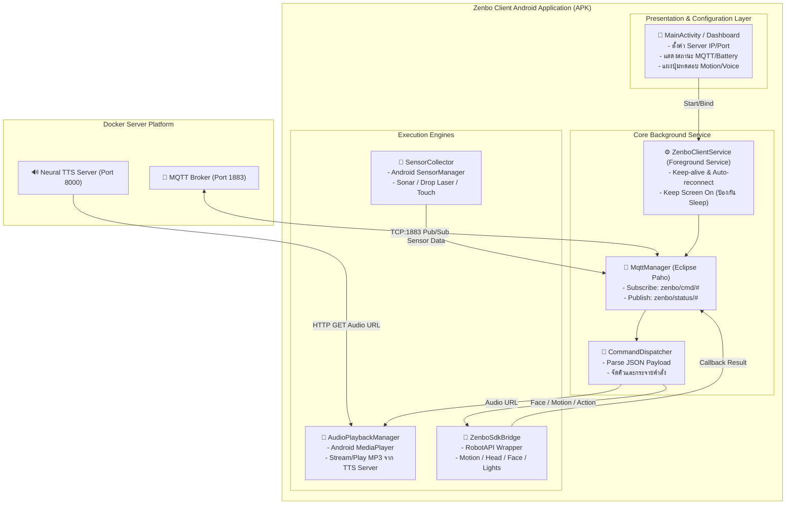
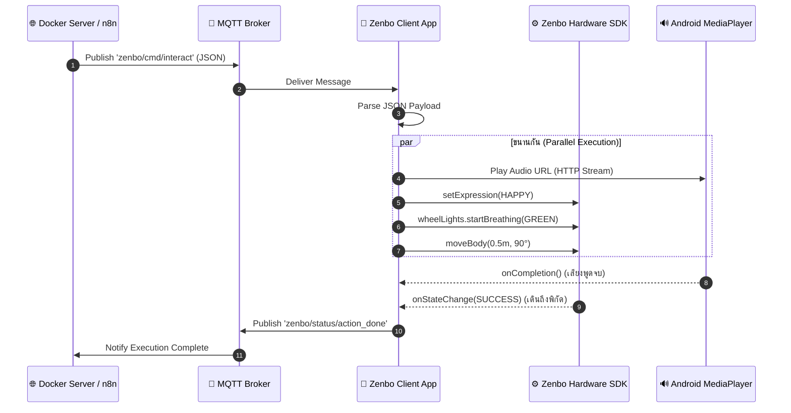

# แผนงานและสถาปัตยกรรมแอปพลิเคชัน Zenbo Client (Android APK Plan)

เอกสารฉบับนี้วิเคราะห์และวางแผนสถาปัตยกรรมการพัฒนาแอปพลิเคชัน Android (**Zenbo Client APK**) สำหรับติดตั้งลงบนตัวหุ่นยนต์ **ASUS Zenbo** เพื่อทำหน้าที่เป็นสะพานเชื่อมต่อ (Bridge Client) รับคำสั่งจากเซิร์ฟเวอร์ Docker ผ่าน **MQTT**, เล่นไฟล์เสียงผ่าน **HTTP Stream**, สั่งการฮาร์ดแวร์ผ่าน **Zenbo SDK** และส่งข้อมูลเซนเซอร์กลับไปยัง Server แบบ Real-time

---

## 1. แผนภาพสถาปัตยกรรมภายในแอปพลิเคชัน (App Architecture Diagram)



---

## 2. โครงสร้างโมดูลหลัก (Core Modules & Classes)

### 2.1 ⚙️ `ZenboClientService` (Background Service)
* **หน้าที่**: รันเป็น Background/Foreground Service เพื่อคงการเชื่อมต่อ MQTT ไว้ตลอดเวลา แม้ผู้ใช้จะสลับหน้าจอ
* **การป้องกันโหมดหลับของ Zenbo**:
  * ใช้ `FLAG_KEEP_SCREEN_ON` และตั้งค่า Intent Category ของ Zenbo เพื่อป้องกันไม่ให้ระบบเด้งกลับหน้า Zenbo Face หลังจาก 1 นาที

### 2.2 🔌 `MqttManager` (Network Engine)
* **เทคโนโลยี**: Eclipse Paho MQTT Client (`org.eclipse.paho.client.mqttv3`)
* **หน้าที่**:
  * จัดการการเชื่อมต่อ `tcp://<SERVER_IP>:1883`
  * มีระบบ **Exponential Backoff Reconnection** เมื่อสัญญาณ Wi-Fi หลุด
  * Subscribe หัวข้อคำสั่ง:
    * `zenbo/cmd/interact` (คำสั่งรวม: เสียง + สีหน้า + ท่าทาง + ไฟ)
    * `zenbo/cmd/speak` (คำสั่งเล่นเสียงพูด)
    * `zenbo/cmd/motion` (คำสั่งเดิน X/Y/Theta)
    * `zenbo/cmd/head` (คำสั่งหันคอ Yaw/Pitch)
    * `zenbo/cmd/action` (คำสั่งเล่นท่า Canned Action)
    * `zenbo/cmd/lights` (คำสั่งไฟ LED ล้อ)
    * `zenbo/cmd/stop` (คำสั่งหยุดฉุกเฉิน)
  * Publish ข้อมูลสถานะ:
    * `zenbo/status/heartbeat` ทุกๆ 5 วินาที
    * `zenbo/status/sensors` เมื่อมีการเปลี่ยนแปลงหรือตามรอบเวลา
    * `zenbo/status/action_done` เมื่อคำสั่งทำงานสำเร็จ

### 2.3 🤖 `ZenboSdkBridge` (Hardware Controller)
* **เทคโนโลยี**: ASUS Zenbo SDK (`RobotAPI`)
* **หน้าที่**:
  * ครอบคำสั่ง SDK ให้อยู่ในรูปแบบที่จัดการง่ายและปลอดภัย (Thread-safe):
    * `setExpression(RobotFace)`: เปลี่ยนสีหน้าตามที่ Server ระบุ
    * `moveBody(x, y, theta, speed)`: สั่งเคลื่อนที่
    * `moveHead(yaw, pitch, speed)`: สั่งหันศีรษะ
    * `playAction(actionId)`: เล่นท่าทาง
    * `wheelLights`: ควบคุมไฟวงแหวน
    * `stopMoving()` / `cancelCommandAll()`: หยุดฉุกเฉิน
  * รับ Callback `onStateChange` และ `onResult` แล้วส่ง Event แจ้งเตือนกลับไปยัง Server

### 2.4 🎵 `AudioPlaybackManager` (Sound Engine)
* **เทคโนโลยี**: Android `MediaPlayer`
* **หน้าที่**:
  * รับ URL เสียงจาก Server (เช่น `http://192.168.1.50:8000/static/hash.mp3`)
  * โหลดและเล่นเสียงผ่านลำโพงของตัวหุ่น Zenbo โดยตรง
  * มี Callback เมื่อเล่นเสียงจบ เพื่อส่งสถานะ `action_done` กลับไปที่ Gateway

### 2.5 📱 `MainActivity` (UI & Settings)
* **หน้าที่**:
  * หน้าจอสำหรับกรอก IP และ Port ของ Server (บันทึกลง `SharedPreferences`)
  * แสดง Log และสถานะการเชื่อมต่อ MQTT
  * ปุ่มทดสอบแบบ Manual (Test Speak, Test Move, Test Light)

---

## 3. ลำดับขั้นตอนการทำงานเมื่อได้รับคำสั่ง (Sequence of Execution)



---

## 4. ข้อกำหนดและการตั้งค่า Gradle & Manifest

### 4.1 ข้อมูลแพลตฟอร์ม
* **Min SDK Version**: `23` (Android 6.0 Marshmallow - ตรงตามสเปก Zenbo M)
* **Target SDK Version**: `26` ถึง `28` (เพื่อให้เข้ากันได้สมบูรณ์กับ Zenbo OS)
* **Compile SDK Version**: `30` หรือ `33`
* **Java Compatibility**: Java 8 (1.8)

### 4.2 ไลบรารีที่ต้องใช้ (`build.gradle`)
```groovy
dependencies {
    // 1. Zenbo SDK
    compileOnly files('libs/ZenboSDK.jar') // หรือ implementation ถ้าฝังในโปรเจกต์
    
    // 2. MQTT Client
    implementation 'org.eclipse.paho:org.eclipse.paho.client.mqttv3:1.2.5'
    implementation 'org.eclipse.paho:org.eclipse.paho.android.service:1.1.1'
    
    // 3. JSON Parsing & Network
    implementation 'com.google.code.gson:gson:2.10.1'
    implementation 'com.squareup.okhttp3:okhttp:4.12.0'
    
    // 4. Android UI & Support
    implementation 'androidx.appcompat:appcompat:1.6.1'
    implementation 'com.google.android.material:material:1.9.0'
}
```

### 4.3 การตั้งค่าสิทธิ์และการเปิดตัวใน `AndroidManifest.xml`
```xml
<manifest xmlns:android="http://schemas.android.com/apk/res/android"
    package="com.hackathon.zenboclient">

    <!-- สิทธิ์การใช้งาน Network และ Wake Lock -->
    <uses-permission android:name="android.permission.INTERNET" />
    <uses-permission android:name="android.permission.ACCESS_NETWORK_STATE" />
    <uses-permission android:name="android.permission.WAKE_LOCK" />
    <uses-permission android:name="android.permission.FOREGROUND_SERVICE" />

    <application
        android:allowBackup="true"
        android:icon="@mipmap/ic_launcher"
        android:label="@string/app_name"
        android:theme="@style/Theme.AppCompat.Light.NoActionBar">

        <activity
            android:name=".MainActivity"
            android:configChanges="orientation|keyboardHidden|screenSize"
            android:exported="true">
            <intent-filter>
                <action android:name="android.intent.action.MAIN" />
                <category android:name="android.intent.category.LAUNCHER" />
                
                <!-- ระบุการทำงานร่วมกับ Zenbo Launcher -->
                <category android:name="com.asus.intent.category.ZENBO" />
                <category android:name="com.asus.intent.category.ZENBO_LAUNCHER" />
                <data android:name="com.asus.intent.data.MIN_ROBOT_API_LEVEL.1" />
            </intent-filter>
        </activity>

        <!-- Service จัดการ MQTT -->
        <service android:name=".service.ZenboClientService" />
        <service android:name="org.eclipse.paho.android.service.MqttService" />
    </application>
</manifest>
```

---

## 5. ขั้นตอนการสร้างโปรเจกต์และการคอมไพล์ APK (Build & Delivery Plan)

| ขั้นตอน (Step) | รายละเอียด | ผลลัพธ์ |
| :--- | :--- | :--- |
| **Step 1: โครงสร้างโปรเจกต์** | สร้างโฟลเดอร์โปรเจกต์ Android Gradle (`zenbo-client-android`) พร้อมไฟล์ `build.gradle`, `settings.gradle` | โครงสร้าง Android Project พร้อม Build |
| **Step 2: พัฒนาซอร์สโค้ด** | เขียนคลาส `MqttManager`, `ZenboSdkBridge`, `AudioPlaybackManager`, `ZenboClientService`, `MainActivity` | Source Code พร้อมทำงาน |
| **Step 3: คอมไพล์ APK** | รัน `./gradlew assembleDebug` (หรือใช้ Gradle Wrapper) เพื่อสร้างไฟล์ `.apk` | ไฟล์ `app-debug.apk` |
| **Step 4: ติดตั้งลงหุ่นยนต์** | เชื่อมต่อสาย Micro-USB หรือ ADB over Wi-Fi ไปยังหุ่นยนต์ Zenbo แล้วสั่ง `adb install -r app-debug.apk` | ติดตั้งลงเครื่อง Zenbo พร้อมใช้งาน |
