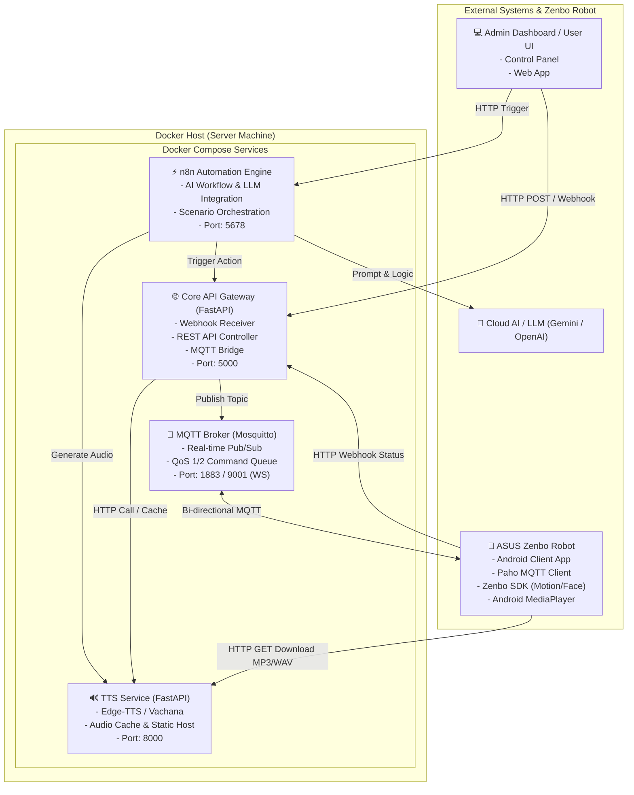

# แผนผังและสถาปัตยกรรมระบบเซิร์ฟเวอร์บน Docker สำหรับเชื่อมต่อ ASUS Zenbo (Dockerized Zenbo Control & Neural Voice Platform)

เอกสารฉบับนี้จัดทำขึ้นเพื่อวางแผนและกำหนดสถาปัตยกรรมของระบบเซิร์ฟเวอร์แบบรวมศูนย์ (Centralized Server Architecture) ที่รันบน **Docker & Docker Compose** เพื่อทำหน้าที่ควบคุม สั่งการ และเชื่อมต่อสื่อสารกับหุ่นยนต์ **ASUS Zenbo** ผ่านช่องทาง **MQTT, Webhook, HTTP REST API** พร้อมทั้งระบบ **Neural TTS (Text-to-Speech)** คุณภาพสูง

---

## 1. แผนภาพสถาปัตยกรรมระบบโดยรวม (System Architecture Diagram)



---

## 2. องค์ประกอบหลักของระบบ (Core Components & Services)

ระบบจะถูกแบ่งออกเป็น 4 คอนเทนเนอร์หลักที่ทำงานร่วมกันผ่าน Docker Internal Network:

### 2.1 📡 MQTT Broker Container (`mqtt-broker`)
* **เทคโนโลยี**: Eclipse Mosquitto (Official Alpine Image)
* **หน้าที่**:
  * เป็นตัวกลางในการรับ-ส่งคำสั่งแบบ Real-time และสองทิศทาง (Bi-directional) ระหว่าง Server กับ Zenbo
  * มี Latency ต่ำมาก เหมาะกับการสั่งท่าทางฉุกเฉิน, อัปเดตตำแหน่งพิกัด, และการรับข้อมูลเซนเซอร์ (Sensors Telemetry)
* **พอร์ตที่เปิดใช้งาน**:
  * `1883`: MQTT TCP Protocol (สำหรับ Zenbo Android App)
  * `9001`: MQTT over WebSocket (สำหรับ Web Dashboard)

### 2.2 🔊 Neural TTS Service Container (`zenbo-tts-service`)
* **เทคโนโลยี**: Python (FastAPI + Edge-TTS + VachanaTTS + Uvicorn)
* **หน้าที่**:
  * สังเคราะห์เสียงพูดภาษาไทยที่เป็นธรรมชาติสูง (Neural Studio Quality)
  * มีระบบ Cache ไฟล์เสียงในตัว เพื่อไม่ต้องประมวลผลประโยคเดิมซ้ำ
  * ให้บริการดาวน์โหลดไฟล์เสียงผ่าน Static HTTP Endpoint เพื่อให้ Zenbo ดึงไปเล่นผ่าน `MediaPlayer`
* **พอร์ตที่เปิดใช้งาน**:
  * `8000`: HTTP REST API & Audio File Server

### 2.3 🌐 Core Gateway & Webhook Server Container (`zenbo-core-api`)
* **เทคโนโลยี**: Python (FastAPI + Paho-MQTT + Pydantic)
* **หน้าที่**:
  * รับ HTTP REST API / Webhook จากระบบภายนอก (เช่น เว็บแอป, เซนเซอร์ภายนอก, n8n)
  * แปลงคำสั่งระดับสูง (High-Level Intent) ให้กลายเป็น MQTT Payload ส่งไปยัง Zenbo
  * บันทึกสถานะการเชื่อมต่อ (Heartbeat) และสถานะเซนเซอร์ของหุ่นยนต์
* **พอร์ตที่เปิดใช้งาน**:
  * `5000`: HTTP Webhook & REST API

### 2.4 ⚡ n8n Workflow Automation Container (`n8n-automation`) *(แนะนำ)*
* **เทคโนโลยี**: n8n Official Image (Node.js)
* **หน้าที่**:
  * เป็นตัวร้อยเรียง Scenario สำหรับการแข่งขัน Hackathon แบบ Low-Code
  * เชื่อมต่อกับ LLM (เช่น Gemini API) เพื่อวิเคราะห์คำสั่งของผู้ใช้ แล้วส่งคำสั่งพูด + ทำท่าทางให้ Zenbo แบบอัตโนมัติ
* **พอร์ตที่เปิดใช้งาน**:
  * `5678`: n8n Web UI

---

## 3. โครงสร้างข้อกำหนดการสื่อสาร (Communication Protocol & Topic Schema)

### 3.1 หัวข้อ MQTT Topics (Pub/Sub Specification)

| หัวข้อ MQTT Topic | ทิศทาง (Direction) | รูปแบบข้อมูล (Payload JSON) | หน้าที่ / คำอธิบาย |
| :--- | :---: | :--- | :--- |
| `zenbo/cmd/speak` | Server $\rightarrow$ Zenbo | `{"audio_url": "...", "text": "...", "face": "HAPPY"}` | สั่งให้ดาวน์โหลดไฟล์เสียงและเล่น พร้อมเปลี่ยนสีหน้า |
| `zenbo/cmd/motion` | Server $\rightarrow$ Zenbo | `{"type": "body", "x": 0.5, "y": 0.0, "theta": 90, "speed": 2}` | สั่งการเคลื่อนที่ตัวหุ่นยนต์ |
| `zenbo/cmd/head` | Server $\rightarrow$ Zenbo | `{"yaw": 30, "pitch": 15, "speed": 2}` | สั่งการหันศีรษะและมุมก้มเงย |
| `zenbo/cmd/action` | Server $\rightarrow$ Zenbo | `{"action_id": 22, "stop": false}` | สั่งเล่นท่าทางสำเร็จรูป (Canned Action) |
| `zenbo/cmd/lights` | Server $\rightarrow$ Zenbo | `{"mode": "breathing", "color": "0x00D031", "brightness": 10}` | ควบคุมไฟ LED วงล้อ |
| `zenbo/cmd/stop` | Server $\rightarrow$ Zenbo | `{"emergency": true}` | คำสั่งหยุดฉุกเฉินทุกลำดับการเคลื่อนที่ |
| `zenbo/status/heartbeat` | Zenbo $\rightarrow$ Server | `{"robot_id": "zenbo_01", "battery": 85, "state": "idle"}` | สัญญาณชีพและสถานะแบตเตอรี่ |
| `zenbo/status/sensors` | Zenbo $\rightarrow$ Server | `{"sonar": [...], "drop_laser": [...], "touch": 1}` | ข้อมูลเซนเซอร์จากตัวหุ่นยนต์ |
| `zenbo/status/action_done`| Zenbo $\rightarrow$ Server | `{"command_id": "cmd_123", "status": "SUCCESS"}` | แจ้งเตือนเมื่อ Action หรือเสียงพูดจบลง |

---

### 3.2 รายการ REST API & Webhook Endpoints (Core Gateway)

#### 1. สั่งให้หุ่นยนต์พูดพร้อมทำท่าทาง (`POST /api/v1/zenbo/interact`)
* **Request Body**:
  ```json
  {
    "text": "สวัสดีครับอาจารย์  วันนี้ผมพร้อมนำเสนอระบบแล้วครับผมม",
    "voice": "male_natural",
    "rate": "-10%",
    "face": "HAPPY",
    "motion": {
      "type": "canned_action",
      "action_id": 22
    },
    "wheel_lights": {
      "mode": "breathing",
      "color": "0x007F7F"
    }
  }
  ```
* **ขั้นตอนการทำงาน (Flow)**:
  1. Gateway ส่งข้อความไปให้ `TTS Service` เพื่อเรนเดอร์ไฟล์เสียง MP3/WAV
  2. `TTS Service` คืนค่า URL ของไฟล์เสียง (เช่น `http://192.168.1.100:8000/audio/hash123.mp3`)
  3. Gateway Publish ข้อมูลไปที่ MQTT Topic `zenbo/cmd/speak` และ `zenbo/cmd/action`
  4. Zenbo รับ MQTT $\rightarrow$ เล่นไฟล์เสียง + เปลี่ยนหน้าตา + หมุนตัวตามท่าทาง

#### 2. สั่งเคลื่อนที่โดยตรง (`POST /api/v1/zenbo/move`)
* **Request Body**:
  ```json
  {
    "x": 0.5,
    "y": 0.0,
    "theta": 90.0,
    "speed_level": 2
  }
  ```

#### 3. สังเคราะห์ไฟล์เสียงตรง (`POST /api/v1/tts/synthesize`)
* **Request Body**:
  ```json
  {
    "text": "ข้อความที่ต้องการให้แปลงเป็นเสียง",
    "voice": "th-TH-PremwadeeNeural",
    "rate": "-10%",
    "pitch": "+2Hz"
  }
  ```
* **Response**: Binary Audio Streaming (audio/mpeg หรือ audio/wav)

---

## 4. โครงร่างไฟล์ Docker Compose (`docker-compose.yml`)

```yaml
version: '3.8'

services:
  # 1. MQTT Message Broker
  mqtt-broker:
    image: eclipse-mosquitto:2.0
    container_name: zenbo-mqtt-broker
    restart: unless-stopped
    ports:
      - "1883:1883"   # MQTT Protocol
      - "9001:9001"   # WebSocket
    volumes:
      - ./mosquitto/config:/mosquitto/config
      - ./mosquitto/data:/mosquitto/data
      - ./mosquitto/log:/mosquitto/log
    networks:
      - zenbo-net

  # 2. Neural Voice & TTS Engine
  zenbo-tts-service:
    build:
      context: ./services/tts-service
      dockerfile: Dockerfile
    container_name: zenbo-tts-service
    restart: unless-stopped
    ports:
      - "8000:8000"
    volumes:
      - ./shared_audio:/app/audio_cache
    networks:
      - zenbo-net
    environment:
      - AUDIO_CACHE_DIR=/app/audio_cache
      - DEFAULT_VOICE_MALE=th-TH-NiwatNeural
      - DEFAULT_VOICE_FEMALE=th-TH-PremwadeeNeural

  # 3. Core API Gateway & MQTT Bridge
  zenbo-core-api:
    build:
      context: ./services/core-api
      dockerfile: Dockerfile
    container_name: zenbo-core-api
    restart: unless-stopped
    ports:
      - "5000:5000"
    depends_on:
      - mqtt-broker
      - zenbo-tts-service
    environment:
      - MQTT_HOST=mqtt-broker
      - MQTT_PORT=1883
      - TTS_SERVICE_URL=http://zenbo-tts-service:8000
    networks:
      - zenbo-net

  # 4. n8n Automation Engine (Low-code workflow)
  n8n-automation:
    image: docker.n8n.io/n8nio/n8n
    container_name: zenbo-n8n
    restart: unless-stopped
    ports:
      - "5678:5678"
    environment:
      - N8N_HOST=0.0.0.0
      - N8N_PORT=5678
      - WEBHOOK_URL=http://localhost:5678/
    volumes:
      - ./n8n_data:/home/node/.n8n
    networks:
      - zenbo-net

networks:
  zenbo-net:
    driver: bridge
```

---

## 5. ฝั่งหุ่นยนต์ ASUS Zenbo (Android App Architecture)

บนตัวหุ่นยนต์ Zenbo จะติดตั้งแอปพลิเคชัน Android ที่มีส่วนประกอบดังนี้:

1. **Background Service (Paho MQTT Client)**:
   * รัน Service เพื่อเชื่อมต่อกับ `tcp://<SERVER_IP>:1883` คอยรับ Topic `zenbo/cmd/#`
   * มีกลไก Auto-Reconnect เมื่อสัญญาณ Wi-Fi หลุด
2. **Command Dispatcher**:
   * เมื่อได้รับ JSON คำสั่ง จะทำการแยกลำดับการประมวลผล:
     * หากมี `audio_url`: สั่ง `MediaPlayer` สตรีมหรือดาวน์โหลดมาเล่น
     * หากมี `face`: สั่ง `robotAPI.robot.setExpression(...)`
     * หากมี `motion`: สั่ง `robotAPI.motion.moveBody(...)`
     * หากมี `action_id`: สั่ง `robotAPI.utility.playAction(...)`
     * หากมี `wheel_lights`: สั่ง `robotAPI.wheelLights.startBreathing(...)`
3. **Heartbeat & Telemetry Daemon**:
   * ส่งค่าพิกัด แบตเตอรี่ และสถานะเซนเซอร์กลับไปยัง Server ทุกๆ 3–5 วินาที

---

## 6. ลำดับขั้นตอนการพัฒนาและติดตั้งจริง (Implementation Roadmap)

| ขั้นตอน (Phase) | รายละเอียดงาน | ผลลัพธ์ที่ได้ |
| :--- | :--- | :--- |
| **Phase 1: Docker Setup** | สร้างโฟลเดอร์โปรเจกต์, ไฟล์ `docker-compose.yml`, ตั้งค่า Mosquitto Configuration | เซิร์ฟเวอร์พร้อมรัน MQTT Broker และ Network ภายใน |
| **Phase 2: TTS & Gateway** | พัฒนา Microservice สำหรับ TTS (FastAPI) และ Core API Gateway สำหรับแปลง HTTP $\rightarrow$ MQTT | API ที่สามารถสั่งสร้างเสียงและส่งคำสั่งผ่าน Swagger UI ได้ |
| **Phase 3: Zenbo Client App** | สร้างโปรเจกต์ Android Studio, เชื่อมต่อ Zenbo SDK และ Paho MQTT | หุ่นยนต์สามารถรับคำสั่งจากเซิร์ฟเวอร์และขยับตัว/พูดได้จริง |
| **Phase 4: n8n Integration** | เชื่อมต่อ n8n เข้ากับ Core Gateway + AI/LLM สำหรับสร้าง Scenario สนทนาอัตโนมัติ | ระบบอัตโนมัติพร้อมโชว์ในงาน Hackathon |
