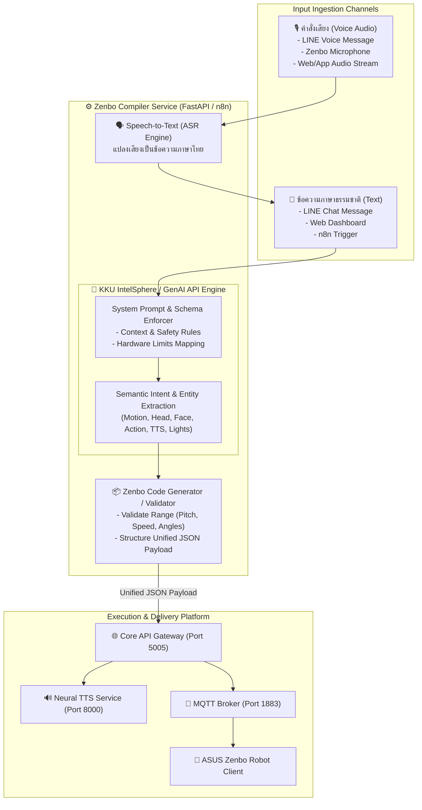

# สถาปัตยกรรมการพัฒนา Service Compiler: แปลงภาษาธรรมชาติและคำสั่งเสียง (KKU IntelSphere API) สู่คำสั่งควบคุมหุ่นยนต์ ASUS Zenbo

เอกสารฉบับนี้จัดทำขึ้นเพื่อวางแผน ออกแบบ และพัฒนา **Zenbo Command Compiler Service** ทำหน้าที่เป็นคอมไพเลอร์อัจฉริยะ (Smart Intent & Action Compiler) เพื่อรับข้อความภาษาธรรมชาติ (Natural Language) หรือไฟล์เสียงพูด (Voice Command) ผ่านการประมวลผลของ **KKU IntelSphere API / GenAI Engine (มหาวิทยาลัยขอนแก่น)** แล้วคอมไพล์แปลงเป็นชุดคำสั่ง Multi-Modal ควบคุมฮาร์ดแวร์หุ่นยนต์ **ASUS Zenbo** ได้อย่างแม่นยำ

---

## 1. แผนภาพสถาปัตยกรรมระบบ Compiler (Service Compiler Pipeline)



---

## 2. การทำงานของ KKU IntelSphere Compiler (Compiler Workflow)

คอมไพเลอร์ทำหน้าที่แปลงประโยคพูดของมนุษย์ที่ไม่มีโครงสร้างตายตัว (Unstructured Natural Language) ให้กลายเป็น **Executable Machine Instructions** ที่ปลอดภัยและถูกต้องตามขีดจำกัดของหุ่นยนต์

### 2.1 ตารางแมปปิ้งคำศัพท์สู่ฮาร์ดแวร์ (Semantic Slot Mapping Table)

| หมวดหมู่ (Category) | คำสำคัญในภาษาไทย (Keywords Example) | พารามิเตอร์ของ Zenbo (Compiled Output) |
| :--- | :--- | :--- |
| **การเดินของหุ่นยนต์** | "เดินหน้า", "ถอยหลัง", "เลี้ยวซ้าย", "หมุนตัวไปทางขวา" | `motion: { x: float, y: float, theta: float, speed: 1-5 }` |
| **การหันศีรษะ/คอ** | "ก้มหน้า", "เงยหน้า", "หันไปมองข้างบน", "หันซ้าย" | `head: { yaw: -45° to 45°, pitch: -15° to 55°, speed: 1-5 }` |
| **การแสดงอารมณ์** | "ยิ้ม", "ดีใจ", "ทำหน้างง", "เขิน", "ตื่นเต้น", "ตกใจ" | `face: "HAPPY", "DOUBT", "SHY", "EXPECT", "SHOCK"` |
| **ท่าทางสำเร็จรูป** | "เต้นให้ดูหน่อย", "ร้องเพลง", "ไหว้ทักทาย", "หมุนรอบตัวเอง" | `action: { action_id: 22, stop: false }` |
| **ระบบไฟล้อ LED** | "เปิดไฟสีเขียว", "ไฟกระพริบสีฟ้า", "ไฟหายใจสีส้ม" | `wheel_lights: { mode: "breathing", color: "0x00D031", brightness: 10 }` |
| **คำพูดตอบสนอง (TTS)**| "แนะนำตัวหน่อย", "บอกทางไปห้องน้ำ", "ช่วยสรุปรายงาน" | `text: "ข้อความตอบกลับภาษาไทยหวานๆ สุภาพ", voice: "female_sweet"` |
| **ความปลอดภัย/หยุด** | "หยุดเดี๋ยวนี้", "อย่าขยับ", "ยกเลิกคำสั่ง" | `emergency: true` (Stop all motions) |

---

## 3. การออกแบบ Prompt และ Output Schema สำหรับ KKU IntelSphere API

เพื่อให้ KKU IntelSphere ส่งคืนข้อมูลในรูปแบบ **Strict JSON** ที่คอมไพเลอร์สามารถนำไป Execute ได้ทันทีโดยไม่ติดข้อความอธิบายรกรุงรัง (No Markdown wrapper):

### 3.1 System Prompt สำหรับ KKU IntelSphere
```text
You are the Zenbo Robot Compiler Engine. Your job is to compile natural language commands (in Thai or English) into structured JSON instructions for an ASUS Zenbo robot.

Strict Rules:
1. Always output ONLY valid JSON matching the schema below.
2. Calculate physical safety limits:
   - x, y: max 2.0 meters per step
   - theta: -180 to 180 degrees
   - yaw (head): -45 to 45 degrees
   - pitch (head): -15 to 55 degrees
   - speed: 1 to 5
3. Select appropriate RobotFace: [HAPPY, DEFAULT, INTEREST, DOUBT, EXPECT, SHY, WORRIED, SHOCK, TIRED, SINGING, PROUD]
4. Select wheel_lights mode: [breathing, blinking, charging, marquee, off]
5. Compose polite, friendly Thai spoken response in the "text" field ending with "นะค้าา" or "ครับผมม".

JSON Output Schema:
{
  "text": "ข้อความที่หุ่นยนต์จะพูดตอบกลับ",
  "voice": "female_sweet",
  "face": "HAPPY",
  "motion": { "x": 0.0, "y": 0.0, "theta": 0.0, "speed": 2 },
  "head": { "yaw": 0.0, "pitch": 0.0, "speed": 2 },
  "action": { "action_id": 22 },
  "wheel_lights": { "mode": "breathing", "color": "0x00D031", "brightness": 10 },
  "emergency": false
}
```

---

## 4. ตัวอย่างการทำงานจริงของ Compiler (Real-world Compilation Examples)

### ตัวอย่างที่ 1: คำสั่งผสม "เดินหน้ามาหาหน่อย แล้วยิ้มหวานๆ แนะนำตัวด้วยนะ"
* **Input (ธรรมชาติ)**: *"เดินหน้ามาหาหน่อย แล้วยิ้มหวานๆ แนะนำตัวด้วยนะ"*
* **Compiled JSON Output**:
  ```json
  {
    "text": "สวัสดีค่าา  หนูชื่อเซนโบ  ยินดีที่ได้รู้จักทุกคนนะค้าา  ",
    "voice": "female_sweet",
    "rate": "-10%",
    "pitch": "+2Hz",
    "face": "HAPPY",
    "motion": {
      "x": 0.8,
      "y": 0.0,
      "theta": 0.0,
      "speed": 2
    },
    "head": {
      "yaw": 0.0,
      "pitch": 15.0,
      "speed": 2
    },
    "wheel_lights": {
      "mode": "breathing",
      "color": "0x00D031",
      "brightness": 10
    },
    "emergency": false
  }
  ```

---

### ตัวอย่างที่ 2: คำสั่งเสียงด่วน "หยุดเดินเดี๋ยวนี้ มีคนขวางอยู่"
* **Input (ธรรมชาติ)**: *"หยุดเดินเดี๋ยวนี้ มีคนขวางอยู่"*
* **Compiled JSON Output**:
  ```json
  {
    "text": "รับทราบค่ะ  หยุดการเคลื่อนที่ทันทีแล้วค่าา  ",
    "voice": "female_sweet",
    "face": "SHOCK",
    "emergency": true,
    "wheel_lights": {
      "mode": "blinking",
      "color": "0xFF0000",
      "brightness": 20
    }
  }
  ```

---

## 5. ซอร์สโค้ดบริการคอมไพเลอร์ (`services/compiler-service/compiler.py`)

บริการ Microservice เขียนด้วย FastAPI สำหรับรับคำสั่งทั้งแบบข้อความและไฟล์เสียง:

```python
import os
import io
import json
import httpx
from fastapi import FastAPI, HTTPException, UploadFile, File, Form
from pydantic import BaseModel, Field
from typing import Optional, Dict, Any

app = FastAPI(title="Zenbo Natural Language & Voice Compiler", version="1.0.0")

KKU_INTELSPHERE_API_URL = os.getenv("KKU_INTELSPHERE_API_URL", "https://gen.ai.kku.ac.th/api/v1/chat/completions")
KKU_API_KEY = os.getenv("KKU_API_KEY", "")
CORE_API_URL = os.getenv("CORE_API_URL", "http://zenbo-core-api:5005")

SYSTEM_PROMPT = """
You are the Zenbo Robot Compiler Engine. Your job is to compile natural language commands (in Thai or English) into structured JSON instructions for an ASUS Zenbo robot.
Always output ONLY valid JSON matching this schema:
{
  "text": "ข้อความที่หุ่นยนต์จะพูดตอบกลับ",
  "voice": "female_sweet",
  "face": "HAPPY",
  "motion": { "x": 0.0, "y": 0.0, "theta": 0.0, "speed": 2 },
  "head": { "yaw": 0.0, "pitch": 0.0, "speed": 2 },
  "action": null,
  "wheel_lights": { "mode": "breathing", "color": "0x00D031", "brightness": 10 },
  "emergency": false
}
"""

class TextCompileRequest(BaseModel):
    command: str = Field(..., example="เซนโบ เดินหน้าหนึ่งเมตร แล้วเปิดไฟสีฟ้าทักทายหน่อย")
    auto_dispatch: bool = Field(default=True, description="ส่งต่อไปยังหุ่นยนต์ทันทีหรือไม่")

@app.post("/api/v1/compiler/text")
async def compile_text_command(req: TextCompileRequest):
    """คอมไพล์ข้อความภาษาธรรมชาติเป็นคำสั่งควบคุม Zenbo ผ่าน KKU IntelSphere"""
    try:
        headers = {
            "Authorization": f"Bearer {KKU_API_KEY}",
            "Content-Type": "application/json"
        }
        payload = {
            "messages": [
                {"role": "system", "content": SYSTEM_PROMPT},
                {"role": "user", "content": req.command}
            ],
            "temperature": 0.2
        }

        # 1. ส่งให้ KKU IntelSphere วิเคราะห์ Intent และคอมไพล์ JSON
        async with httpx.AsyncClient() as client:
            res = await client.post(KKU_INTELSPHERE_API_URL, json=payload, headers=headers, timeout=15.0)
            
            if res.status_code != 200:
                # Fallback: Local Semantic Rules Parser หาก API เชื่อมต่อไม่ได้
                compiled_json = local_fallback_parser(req.command)
            else:
                raw_content = res.json()["choices"][0]["message"]["content"]
                compiled_json = json.loads(raw_content)

        # 2. Dispatch คำสั่งไปยัง Core API Gateway
        dispatch_result = None
        if req.auto_dispatch:
            async with httpx.AsyncClient() as client:
                if compiled_json.get("emergency"):
                    dispatch_res = await client.post(f"{CORE_API_URL}/api/v1/robot/stop")
                else:
                    dispatch_res = await client.post(f"{CORE_API_URL}/api/v1/robot/interact", json=compiled_json)
                dispatch_result = dispatch_res.json()

        return {
            "status": "compiled_successfully",
            "original_command": req.command,
            "compiled_payload": compiled_json,
            "dispatch_result": dispatch_result
        }

    except Exception as e:
        raise HTTPException(status_code=500, detail=f"Compiler Error: {str(e)}")

def local_fallback_parser(text: str) -> Dict[str, Any]:
    """กฎวิเคราะห์ไวยากรณ์ภาษาไทยเบื้องต้น (Offline Fallback Engine)"""
    motion = None
    face = "HAPPY"
    emergency = False
    action = None
    wheel_lights = {"mode": "breathing", "color": "0x00D031", "brightness": 10}

    if "หยุด" in text or "อย่า" in text:
        emergency = True
        face = "SHOCK"
        wheel_lights = {"mode": "blinking", "color": "0xFF0000", "brightness": 20}
    elif "เดินหน้า" in text:
        motion = {"x": 0.5, "y": 0.0, "theta": 0.0, "speed": 2}
    elif "ถอยหลัง" in text:
        motion = {"x": -0.5, "y": 0.0, "theta": 0.0, "speed": 2}
    elif "เต้น" in text or "ร้องเพลง" in text:
        action = {"action_id": 22, "stop": False}
        face = "SINGING"

    return {
        "text": f"รับทราบคำสั่ง '{text}' เรียบร้อยแล้วค่าา  ",
        "voice": "female_sweet",
        "face": face,
        "motion": motion,
        "head": None,
        "action": action,
        "wheel_lights": wheel_lights,
        "emergency": emergency
    }
```

---

## 6. แนวทางการผสานร่วมกับ n8n และ LINE Webhook

1. **LINE Audio Message $\rightarrow$ ASR**: เมื่อผู้ใช้ส่งคลิปเสียงใน LINE $\rightarrow$ n8n ดาวน์โหลด Audio Stream แล้วส่งเข้า Compiler Service
2. **LINE Text Message $\rightarrow$ Compiler Service**: n8n ส่งข้อความตรงเข้า `POST /api/v1/compiler/text`
3. **Execution & Feedback**: เมื่อ Compiler สั่งงาน Zenbo ผ่าน MQTT แล้ว จะส่งข้อความยืนยันสถานะการทำงานกลับไปยังหน้าแชต LINE ของผู้ใช้ทันที
