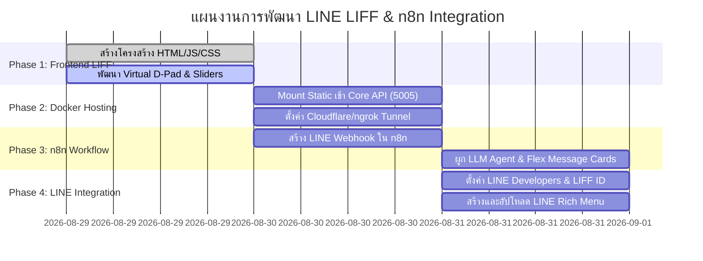

# แผนงานการพัฒนา LINE LIFF Remote Controller & LINE Automation สำหรับ ASUS Zenbo (Implementation Plan)

เอกสารฉบับนี้กำหนดแผนปฏิบัติงานและขั้นตอนการพัฒนาอย่างละเอียดในการสร้าง **LINE LIFF Web Application (Zenbo Mobile Control Center)** ร่วมกับ **LINE Messaging API**, **n8n Workflow Engine** และ **Docker Stack** เพื่อให้สามารถควบคุมหุ่นยนต์ ASUS Zenbo ได้อย่างสมบูรณ์แบบผ่านแอปพลิเคชัน LINE

---

## 1. ผังโครงสร้างโปรเจกต์และส่วนประกอบ (Project Structure)

```
zenbo-hackathon/
├── docker-compose.yml                     # จัดการ Services ทั้งหมด (MQTT, Core API, TTS, n8n, LIFF Host)
├── services/
│   ├── liff-app/                          # 📱 Frontend LIFF Web App
│   │   ├── index.html                     # หน้าจอรีโมตควบคุม (Virtual Joystick, Slider, Face Grid)
│   │   ├── app.js                         # ตรรกะการเชื่อมต่อ LIFF SDK และส่ง Fetch/WebSocket เข้า Core API
│   │   └── style.css                      # ปรับแต่งธีมและ UI สไตล์โมเดิร์น (Tailwind CSS)
│   ├── core-api/                          # 🌐 Core API Gateway & Static Server
│   ├── tts-service/                       # 🔊 Neural TTS Service
│   └── compiler-service/                  # 🧠 Intent & Voice Compiler
├── n8n_workflows/
│   └── zenbo_line_bot_workflow.json       # ⚡ Workflow สำเร็จรูปสำหรับ Import เข้า n8n (https://libn.kku.ac.th/)
└── assets/
    └── richmenu_template.png              # 📊 ภาพปุ่ม Rich Menu สำหรับ LINE Official Account
```

---

## 2. ข้อมูลจำเพาะของหน้าจอ LIFF Remote Controller (UI/UX Specification)

หน้าเว็บแอปจะถูกออกแบบให้เป็น **Single-Page Mobile Web App (PWA & LIFF Ready)** มีขนาดพอดีกับหน้าจอสมาร์ตโฟน โดยแบ่งเป็น 6 ส่วนหลัก:

### 2.1 🔋 ส่วนที่ 1: Header Bar (แถบสถานะ)
* แสดงชื่อหุ่นยนต์ `ASUS Zenbo`
* แสดงไฟสถานะการเชื่อมต่อ: `🟢 Connected` หรือ `🔴 Disconnected`
* แสดงระดับแบตเตอรี่แบบ Real-time (เช่น `🔋 85%`)
* ปุ่ม **[🛑 Emergency Stop]** สีแดงเด่นชัดที่มุมขวาบน

### 2.2 🕹️ ส่วนที่ 2: Motion Control (Virtual D-Pad & Joystick)
* **รูปแบบ**: ปุ่มควบคุมทิศทางแบบ Touch Interaction (กดค้าง = เดินต่อเนื่อง, ปล่อย = หยุด)
* **ปุ่มควบคุม**:
  * `▲ เดินหน้า` : สั่ง `motion: { x: 0.5, y: 0, theta: 0, speed: 2 }`
  * `▼ ถอยหลัง` : สั่ง `motion: { x: -0.5, y: 0, theta: 0, speed: 2 }`
  * `◄ หมุนซ้าย` : สั่ง `motion: { x: 0, y: 0, theta: -45, speed: 2 }`
  * `► หมุนขวา` : สั่ง `motion: { x: 0, y: 0, theta: 45, speed: 2 }`
* **ตัวปรับความเร็ว (Speed Selector)**: เลือกระดับความเร็วได้ 1 ถึง 5

### 2.3 👤 ส่วนที่ 3: Head Tilt & Yaw Control (ควบคุมศีรษะ)
* **Yaw Slider (หันซ้าย-ขวา)**: ช่วงองศา `-45°` ถึง `+45°`
* **Pitch Slider (ก้ม-เงย)**: ช่วงองศา `-15°` (ก้ม) ถึง `+55°` (เงย)
* **ปุ่ม Reset**: กดเพื่อรีเซ็ตศีรษะกลับสู่ตำแหน่งกึ่งกลาง (Yaw: 0°, Pitch: 0°)

### 2.4 😊 ส่วนที่ 4: Facial Expression Grid (เลือกสีหน้า 24 อารมณ์)
* แสดงปุ่มการ์ดสีหน้าแบบ Grid 4 คอลัมน์ พร้อมไอคอน Emoji:
  * `😄 Happy`, `🤔 Doubt`, `😳 Shy`, `😴 Tired`, `😎 Proud`, `😲 Shock`, `🎤 Singing`, `🧐 Interest` ฯลฯ
* เมื่อแตะที่ปุ่มใด หุ่นยนต์จะเปลี่ยนสีหน้าบนจอแท็บเล็ตทันที

### 2.5 💡 ส่วนที่ 5: Wheel Lights Controller (ระบบไฟล้อ)
* **Mode Toggle**: `Breathing (หายใจ)`, `Blinking (กระพริบ)`, `Charging (วิ่งชาร์จ)`, `Marquee (ไฟวิ่งรอบ)`
* **Color Palette**: เลือกสีด่วน (🟢 เขียว, 🔵 ฟ้า, 🟠 ส้ม, 🔴 แดง, 🟣 ม่วง) หรือ Color Picker แบบ HEX

### 2.6 📢 ส่วนที่ 6: Real-time Speech Synthesizer (สั่งพิมพ์ให้พูด)
* ช่องพิมพ์ข้อความภาษาไทย
* ตัวเลือกโทนเสียง: `เสียงผู้หญิงหวานละมุน (Sweet Female)` หรือ `เสียงผู้ชายสุขุม (Smart Male)`
* ปุ่ม **[🗣️ สั่งพูดออกลำโพง]**

---

## 3. ลำดับขั้นตอนการพัฒนา (Phase-by-Phase Execution Plan)



### รายละเอียดแต่ละเฟส:

#### 🔹 เฟสที่ 1: พัฒนาหน้าเว็บแอป LIFF (`services/liff-app/`)
1. สร้างไฟล์ `index.html` แบบ Responsive Mobile First ใช้ Tailwind CSS (CDN)
2. เขียน `app.js` รองรับ Touch Event ของ D-Pad และเชื่อมต่อกับ LINE LIFF SDK (`@line/liff`)
3. ทำฟังก์ชันส่ง REST API ไปที่ `POST /api/v1/robot/interact`

#### 🔹 เฟสที่ 2: ให้บริการเว็บแอปและทำ Tunnel ให้ LINE เข้าถึงได้
1. ปรับ `zenbo-core-api` ให้ทำหน้าที่ Static File Server เสิร์ฟหน้าเว็บโฟลเดอร์ `services/liff-app` ที่พอร์ต `5005`
2. ใช้เครื่องมือสร้าง Public HTTPS URL (เช่น Cloudflare Tunnel `cloudflared` หรือ `ngrok`) เพื่อให้ LINE LIFF สามารถเข้าถึงหน้าเว็บจากอินเทอร์เน็ตได้

#### 🔹 เฟสที่ 3: ออกแบบ n8n Workflow (LINE Webhook + AI + Zenbo)
1. สร้าง Webhook Node ใน n8n เพื่อรับ Event จาก LINE
2. ใส่ LLM Chain Node (ต่อเข้ากับ Gemini API หรือ KKU IntelSphere) เพื่อสกัด Intent
3. ใส่ HTTP Request Node เพื่อยิงคำสั่งเข้า Core API Gateway
4. ตอบกลับผู้ใช้ใน LINE ด้วยการ์ด **LINE Flex Message**

#### 🔹 เฟสที่ 4: เชื่อมต่อ LINE Developers Console & Rich Menu
1. เข้าไปที่ [LINE Developers Console](https://developers.line.biz/)
2. สร้าง **LIFF App** ภายใต้ Messaging Channel และระบุ Endpoint URL ที่ได้จาก Phase 2
3. สร้าง **Rich Menu** 4 ช่องใน LINE Official Account Manager เพื่อให้ผู้ใช้กดเปิด LIFF App หรือสั่งงานด่วนได้ทันที

---

## 4. รายการ Checklist การทดสอบระบบ (Verification Checklist)

- [ ] **การเปิดหน้า LIFF**: เปิดผ่านแอป LINE บนมือถือได้ลื่นไหล ไม่กระตุก
- [ ] **การควบคุมการเคลื่อนที่**: กดปุ่ม D-Pad ค้างแล้วหุ่นยนต์เคลื่อนที่ตามทิศทาง และหยุดทันทีเมื่อปล่อยนิ้ว
- [ ] **การเปลี่ยนสีหน้า**: แตะเลือกสีหน้าใน Grid แล้วหน้าจอหุ่นยนต์เปลี่ยนตามทันที
- [ ] **การสังเคราะห์เสียง**: พิมพ์ข้อความแล้วหุ่นยนต์เปล่งเสียงภาษาไทยระดับ Neural Voice ออกลำโพง
- [ ] **การสั่งงานผ่านแชต LINE**: ส่งข้อความหรือคลิปเสียงใน LINE แล้วหุ่นยนต์รับคำสั่ง พร้อมตอบกลับด้วยการ์ด Flex Message
- [ ] **ปุ่มหยุดฉุกเฉิน (Emergency Stop)**: กดแล้วทุกลำดับการเคลื่อนที่และเสียงหยุดทำงานทันที 100%
