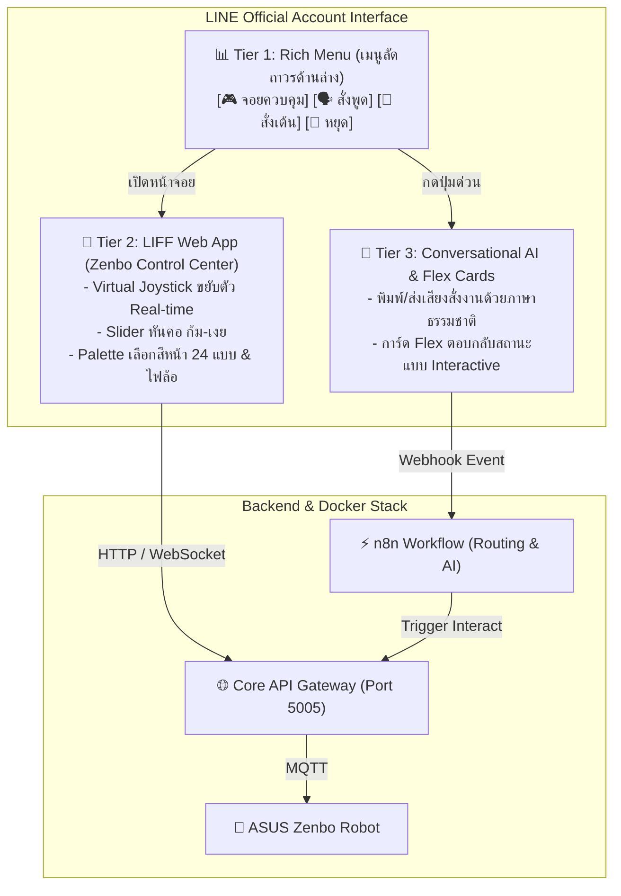

# การวิเคราะห์และออกแบบ UX/UI สำหรับควบคุมหุ่นยนต์ ASUS Zenbo ผ่าน LINE (LINE UX/UI Architecture & Strategy)

เอกสารฉบับนี้วิเคราะห์และเสนอแนวทางการออกแบบ **User Experience (UX) และ User Interface (UI)** สำหรับการควบคุมและมีปฏิสัมพันธ์กับหุ่นยนต์ **ASUS Zenbo** ผ่านแพลตฟอร์ม **LINE** เพื่อให้ใช้งานง่าย ลื่นไหล ทันสมัย และตอบโจทย์การนำเสนอในการแข่งขัน Hackathon

---

## 1. การเปรียบเทียบรูปแบบ UX/UI บน LINE (Comparison of Approaches)

การควบคุมอุปกรณ์ IoT หรือหุ่นยนต์ผ่าน LINE สามารถทำได้ 3 รูปแบบหลัก ซึ่งมีข้อดี-ข้อจำกัดแตกต่างกัน:

| รูปแบบ (Approach) | รูปแบบ UI | จุดเด่น (Pros) | ข้อจำกัด (Cons) | เหมาะกับงานลักษณะใด |
| :--- | :--- | :--- | :--- | :--- |
| **1. LINE Rich Menu & Flex Message** | เมนูปุ่มด้านล่าง + การ์ดข้อความโต้ตอบ | • เข้าถึงได้ทันที ไม่ต้องโหลดหน้าเว็บ<br/>• ไม่เปลืองเน็ต ใช้งานง่ายมาก | • ปรับแต่งแอนิเมชันหรือทำ Joystick เลื่อนสดๆ ไม่ได้ | คำสั่ง Preset ด่วน (เช่น ทักทาย, เต้น, สั่งหยุด, ตรวจแบต) |
| **2. LIFF Web App (LINE Front-end Framework)** | เว็บแอปพลิเคชันที่เปิดขึ้นมาแบบ Seamless ใน LINE | • **ทำ Joystick ขยับหุ่นได้ Real-time**<br/>• มี Color Picker เลือกสีไฟ<br/>• มี Slider หันคอ/ปรับเสียง<br/>• แสดงกล้อง/เซนเซอร์สด | • ต้องใช้เวลาโหลดหน้าเว็บเล็กน้อยในครั้งแรก (1-2 วิ) | การควบคุมละเอียด (Remote Driving, จูนเสียง, เลือกสีหน้า) |
| **3. Conversational AI (Chat & Voice)** | พิมพ์ข้อความอิสระ หรือส่งคลิปเสียง | • เป็นธรรมชาติที่สุด พูดสั่งงานได้อิสระ<br/>• ขับเคลื่อนด้วย AI / KKU IntelSphere | • ความแม่นยำขึ้นอยู่กับคำพูดของผู้ใช้ | การสั่งงานแบบ Multi-modal และงานบริการ |

---

## 2. โซลูชันที่แนะนำ: สถาปัตยกรรมแบบไฮบริด 3 ระดับ (The Recommended Hybrid 3-Tier UX/UI)

เพื่อมอบประสบการณ์ที่ดีที่สุด ขอแนะนำให้ใช้ **Hybrid Architecture** โดยผสมผสานทั้ง 3 รูปแบบเข้าด้วยกัน:



---

## 3. รายละเอียดการออกแบบ UI แต่ละส่วน (Wireframe & Layouts)

### 3.1 📊 Tier 1: LINE Rich Menu (เมนูปุ่มลัดถาวร)
วางเป็นแถบเมนูด้านล่างของห้องแชต LINE แบ่งเป็น 4–6 ปุ่มหลัก:

```
┌──────────────────────────────────────────────────────────┐
│                     LINE Chat Room                       │
│                                                          │
│  [Zenbo Bot]: สวัสดีค่ะ! ต้องการให้หนูช่วยอะไรดีคะ?     │
│                                                          │
├────────────────────────────┬─────────────────────────────┤
│ 🎮 รีโมตควบคุม (เปิด LIFF) │ 🗣️ สั่งพิมพ์พูด (TTS)      │
├────────────────────────────┼─────────────────────────────┤
│ 💃 ท่าทางพิเศษ (เต้น/ไหว้)  │ 🛑 หยุดฉุกเฉิน (STOP)       │
└────────────────────────────┴─────────────────────────────┘
```

* **ปุ่มที่ 1 (🎮 รีโมตควบคุม)**: ลิงก์ไปยัง `https://liff.line.me/YOUR_LIFF_ID` เพื่อเปิด Web App ควบคุมละเอียด
* **ปุ่มที่ 2 (🗣️ สั่งพิมพ์พูด)**: ส่ง Quick Reply หรือ Template ให้พิมพ์ข้อความที่ต้องการให้หุ่นยนต์พูด
* **ปุ่มที่ 3 (💃 ท่าทางพิเศษ)**: สุ่มหรือเปิดการ์ดเมนู Canned Actions (Dance, Bow, Wave)
* **ปุ่มที่ 4 (🛑 หยุดฉุกเฉิน)**: ส่งคำสั่ง `zenbo/cmd/stop` ทันทีเพื่อความปลอดภัย

---

### 3.2 📱 Tier 2: LIFF Web App (Zenbo Mobile Control Center)
พัฒนาด้วย **HTML5 + Tailwind CSS + Vue.js/React** ให้เปิดใช้งานใน LINE โดยไม่ต้องสลับแอป:

```
┌──────────────────────────────────────────────────────────┐
│ 🤖 Zenbo Remote Controller (LIFF)           [🔋 85%] [🟢 Online] │
├──────────────────────────────────────────────────────────┤
│                                                          │
│ [ 🕹️ Base Motion Control ]                               │
│                         ▲ (เดินหน้า)                     │
│               ◄ (ซ้าย)    ●    ► (ขวา)                   │
│                         ▼ (ถอยหลัง)                      │
│                                                          │
├──────────────────────────────────────────────────────────┤
│ [ 👤 Head Tilt Control ]                                 │
│   Yaw (หันซ้าย-ขวา) : ◄───[ 0° ]───►                     │
│   Pitch (ก้ม-เงย)   : ◄───[ 15°]───►                     │
├──────────────────────────────────────────────────────────┤
│ [ 😊 Face & Emotion Selector ]                           │
│   [ 😄 Happy ]  [ 🤔 Doubt ]  [ 😳 Shy ]  [ 😴 Tired ]   │
├──────────────────────────────────────────────────────────┤
│ [ 💡 Wheel Lights ]                                      │
│   โหมด: [ Breathing ▼ ]   สี: [ 🟢 Green ▼ ]             │
├──────────────────────────────────────────────────────────┤
│ [ 📢 Quick Speech Box ]                                  │
│   [ พิมพ์ข้อความภาษาไทย...                     ] [ ส่ง ] │
└──────────────────────────────────────────────────────────┘
```

#### คุณสมบัติเด่นของ LIFF Web App:
1. **Virtual D-Pad / Joystick**: แตะค้างเพื่อเดินหน้า/ถอยหลัง/หมุนตัวแบบ Real-time ผ่าน WebSocket หรือ HTTP Fetch
2. **Interactive Face Picker**: จิ้มเปลี่ยนสีหน้าหุ่นยนต์ได้ทันทีทั้ง 24 รูปแบบ
3. **Color Picker ไฟล้อ**: เลือกเฉดสี RGB เพื่อให้ไฟ LED ที่ล้อเปลี่ยนสีตามต้องการ
4. **Auto LINE Authentication**: รู้ตัวตนของผู้สั่งการอัตโนมัติผ่าน `liff.getProfile()`

---

### 3.3 💬 Tier 3: Interactive LINE Flex Messages (การ์ดโต้ตอบในแชต)
เมื่อผู้ใช้สั่งงานผ่านเสียงหรือข้อความ ระบบ n8n จะส่ง **Flex Message** สวยงามกลับมาในแชต:

```json
{
  "type": "bubble",
  "header": {
    "type": "box",
    "layout": "vertical",
    "contents": [
      { "type": "text", "text": "🤖 Zenbo Status Report", "weight": "bold", "color": "#2563EB" }
    ]
  },
  "body": {
    "type": "box",
    "layout": "vertical",
    "contents": [
      { "type": "text", "text": "กำลังดำเนินการ: เดินหน้าและทักทาย", "size": "sm" },
      { "type": "text", "text": "อารมณ์ปัจจุบัน: HAPPY 😄", "size": "xs", "color": "#64748B" },
      { "type": "text", "text": "แบตเตอรี่: 85% 🔋", "size": "xs", "color": "#10B981" }
    ]
  },
  "footer": {
    "type": "box",
    "layout": "horizontal",
    "spacing": "sm",
    "contents": [
      {
        "type": "button",
        "style": "primary",
        "color": "#DC2626",
        "action": { "type": "postback", "label": "🛑 หยุดทันที", "data": "action=stop" }
      },
      {
        "type": "button",
        "style": "secondary",
        "action": { "type": "uri", "label": "🎮 เปิดจอยสติ๊ก", "uri": "https://liff.line.me/YOUR_LIFF_ID" }
      }
    ]
  }
}
```

---

## 4. แผนการพัฒนาและสแต็กเทคโนโลยี (Implementation Tech Stack)

| ส่วนประกอบ (Component) | เทคโนโลยีที่แนะนำ | หน้าที่ |
| :--- | :--- | :--- |
| **Frontend LIFF App** | HTML5 + Tailwind CSS + Vanilla JS / Vue 3 | เว็บแอปหน้าตาโมเดิร์น โหลดไว รันใน LINE Browser |
| **Backend API Gateway** | FastAPI (รันบน Docker Port 5005) | รับ Request จาก LIFF App และส่งต่อเข้า MQTT |
| **Workflow & LINE Webhook** | n8n (https://libn.kku.ac.th/) | รับ Webhook จาก LINE OA และเรียกใช้ Gemini / KKU IntelSphere |
| **Audio & TTS Engine** | FastAPI + Edge-TTS (Docker Port 8000) | สังเคราะห์เสียงพูดส่งให้ Zenbo เล่น |

---

## 5. สรุปคำแนะนำสำหรับทีมพัฒนา

1. **ควรสร้าง Web App (LIFF) หรือไม่?**
   * **คำตอบ: ควรสร้างอย่างยิ่ง!** เพราะ LIFF คือจุดขายสำคัญในการเดโมงาน Hackathon ทำให้กรรมการหรือผู้ใช้งานสามารถหยิบมือถือตัวเองสแกน QR Code แล้วควบคุมหุ่นยนต์ Zenbo ได้ทันทีโดยไม่ต้องลงแอปเพิ่ม
2. **โครงสร้างที่แนะนำให้เริ่มทำทันที**:
   * **ขั้นที่ 1**: สร้างหน้าเว็บ LIFF แบบ Single-File HTML สำหรับเป็นหน้าจอ Remote Joystick
   * **ขั้นที่ 2**: เชื่อมปุ่มในหน้าเว็บเข้ากับ API `POST /api/v1/robot/interact`
   * **ขั้นที่ 3**: นำ URL หน้าเว็บไปผูกกับ LINE Developers Console ในเมนู LIFF App
   * **ขั้นที่ 4**: ตั้งค่า Rich Menu ใน LINE OA ให้มีปุ่มกดเปิด LIFF App
