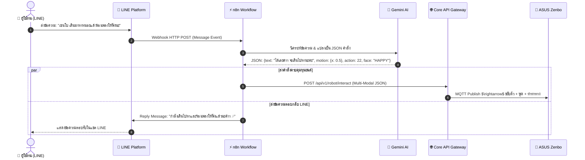

# สถาปัตยกรรมและการรวมระบบ Zenbo ร่วมกับ n8n, Model Context Protocol (MCP) และ LINE Messaging API

เอกสารฉบับนี้จัดทำขึ้นเพื่อวิเคราะห์ ออกแบบสถาปัตยกรรม และกำหนดแนวทางการพัฒนาการเชื่อมต่อแบบบูรณาการระหว่าง **ASUS Zenbo**, **n8n Workflow Engine**, **Model Context Protocol (MCP Server)** และ **LINE Official Account (LINE Messaging API)** เพื่อยกระดับให้หุ่นยนต์สามารถสั่งการได้ผ่านแอปพลิเคชัน LINE, ขับเคลื่อนด้วย AI Agent ผ่านมาตรฐาน MCP และจัดการ Business Logic ผ่าน Workflows บน n8n

---

## 1. ผังโครงสร้างสถาปัตยกรรมระบบรวม (Integrated Ecosystem Architecture)

```mermaid
flowchart TB
    subgraph USER_LAYER["User & Developer Interfaces"]
        LINE_USER["📱 LINE App User<br/>(พิมพ์ข้อความ / ส่งเสียง / เมนู)"]
        AI_AGENT["🤖 AI Agent / IDE / Chatbot<br/>(Antigravity / Cursor / Claude / Gemini)"]
    end

    subgraph CLOUD_SERVICES["External Services"]
        LINE_PLATFORM["💬 LINE Messaging API Platform<br/>- Webhook Event<br/>- Push / Reply Message"]
        LLM_API["🧠 LLM Engine (Google Gemini / OpenAI)"]
    end

    subgraph DOCKER_STACK["Docker Host Platform"]
        subgraph N8N_ENGINE["⚡ n8n Automation Engine (Port 5678)"]
            N8N_LINE["Webhook: LINE Events"]
            N8N_AI["AI Agent / LLM Chain Node"]
            N8N_ROUTING["Scenario & Logic Flow"]
        end

        subgraph MCP_SERVICE["🔌 Zenbo MCP Server (Port 8088 / Stdio)"]
            MCP_CORE["MCP Server Endpoint (SSE / JSON-RPC)<br/>- Tools: zenbo_speak, zenbo_move<br/>- Tools: zenbo_action, zenbo_lights"]
        end

        subgraph BACKEND_STACK["Core Infrastructure"]
            GATEWAY["🌐 Core API Gateway (Port 5005)"]
            TTS["🔊 Neural TTS Service (Port 8000)"]
            MQTT["📡 MQTT Broker (Port 1883)"]
        end
    end

    subgraph ROBOT_DEVICE["🤖 ASUS Zenbo Robot"]
        CLIENT_APK["Zenbo Client App (APK)<br/>- Paho MQTT<br/>- MediaPlayer<br/>- Zenbo SDK"]
    end

    %% Flows
    LINE_USER <-->|Chat & Webhook| LINE_PLATFORM
    LINE_PLATFORM -->|HTTP Webhook| N8N_LINE
    
    AI_AGENT <-->|Model Context Protocol (MCP)| MCP_CORE
    MCP_CORE -->|HTTP POST| GATEWAY

    N8N_LINE --> N8N_AI
    N8N_AI <-->|Prompt & Tool Calls| LLM_API
    N8N_AI --> N8N_ROUTING
    
    N8N_ROUTING -->|HTTP Trigger Interact| GATEWAY
    N8N_ROUTING -->|HTTP Reply Message| LINE_PLATFORM

    GATEWAY -->|Synthesize Audio| TTS
    GATEWAY -->|Publish Topic| MQTT
    MQTT <-->|Bi-directional MQTT| CLIENT_APK
```

---

## 2. การแบ่งหน้าที่ของ Service บน n8n (n8n Workflow Service Delegation)

การย้าย Business Logic และ AI Orchestration ไปรันบน n8n ช่วยให้ระบบมีความยืดหยุ่นสูง ปรับแต่ง Scenario ได้รวดเร็วในงาน Hackathon:

### 2.1 งานที่มอบหมายให้ n8n รับผิดชอบ (What runs in n8n)
1. **LINE Webhook Receiver & Parser**:
   * รับ Event จาก LINE (ข้อความ, รูปภาพ, Location, เสียง)
   * แยกรหัส `userId`, `replyToken`, `messageText`
2. **AI Reasoning & Decision Making (LLM Agent Node)**:
   * นำข้อความจาก LINE ส่งให้ **Google Gemini API / OpenAI** พร้อม System Prompt ที่กำหนดบุคลิกของ Zenbo
   * สกัดผลลัพธ์เป็น **Multi-Modal Action Plan** (เช่น ข้อความที่จะพูด + สีหน้า + ท่าทาง)
3. **Workflow Orchestration (เชื่อมต่อ Microservices)**:
   * เรียก API `http://zenbo-core-api:5005/api/v1/robot/interact` เพื่อสั่งให้หุ่นยนต์ขยับตัวและพูดออกลำโพง
   * ส่งข้อความตอบกลับหาผู้ใช้ใน LINE (Reply Message) พร้อมส่งภาพถ่ายหรือรายงานสถานะ
4. **Scheduled & Proactive Triggers**:
   * Cron Job ทักทายยามเช้า / เตือนกินยา / แจ้งเตือนการประชุม
   * รับ Webhook จากเซนเซอร์ภายนอก (เช่น กล้องตรวจจับคน, อุณหภูมิ) แล้วสั่ง Zenbo เดินไปตรวจตรา

---

## 3. การออกแบบ Zenbo MCP Server (Model Context Protocol)

**MCP (Model Context Protocol)** เป็นมาตรฐานเปิดที่ทำให้ AI Agents (เช่น Claude Desktop, Antigravity, Cursor, หรือ LLM ใดๆ) สามารถเรียกใช้คำสั่งควบคุมหุ่นยนต์ Zenbo เป็น **Tools** ได้โดยตรง

### 3.1 เครื่องมือที่เปิดให้ AI เรียกใช้ (Exposed MCP Tools)

| Tool Name | Parameters | คำอธิบาย (Description for LLM) |
| :--- | :--- | :--- |
| `zenbo_speak` | `text` (str), `voice` (str), `face` (str) | สั่งให้หุ่นยนต์สังเคราะห์เสียงพูดภาษาไทยธรรมชาติ พร้อมเปลี่ยนสีหน้า |
| `zenbo_move` | `x` (float), `y` (float), `theta` (float), `speed` (int) | สั่งเคลื่อนที่ตัวหุ่นยนต์ (ระยะทางเมตร, มุมหมุนองศา) |
| `zenbo_move_head` | `yaw` (float), `pitch` (float), `speed` (int) | สั่งหันศีรษะซ้าย-ขวา (-45° ถึง 45°) และก้มเงย (-15° ถึง 55°) |
| `zenbo_play_action` | `action_id` (int) | สั่งเล่นท่าทางอนิเมชันสำเร็จรูป (Canned Action เช่น เต้น, คำนับ, ดีใจ) |
| `zenbo_set_lights` | `mode` (str), `color` (str), `brightness` (int) | ควบคุมไฟวงแหวน LED ที่ล้อ (blinking, breathing, charging, marquee) |
| `zenbo_emergency_stop`| - | สั่งหยุดการเคลื่อนไหวของหุ่นยนต์ทันทีในทุกกรณี |
| `zenbo_get_status` | - | ตรวจสอบสถานะการเชื่อมต่อ แบตเตอรี่ และข้อมูลเซนเซอร์ล่าสุด |

### 3.2 โครงร่างซอร์สโค้ด Zenbo MCP Server (`services/mcp-server/server.py`)
```python
import os
import httpx
from mcp.server.fastmcp import FastMCP

mcp = FastMCP("Zenbo-Controller-MCP")
CORE_API_URL = os.getenv("CORE_API_URL", "http://zenbo-core-api:5005")

@mcp.tool()
async def zenbo_speak(text: str, voice: str = "female_sweet", face: str = "HAPPY") -> str:
    """Make ASUS Zenbo speak text in Thai using neural studio voice and show facial expression."""
    async with httpx.AsyncClient() as client:
        res = await client.post(f"{CORE_API_URL}/api/v1/robot/interact", json={
            "text": text,
            "voice": voice,
            "face": face
        })
        return f"Dispatched speak command to Zenbo. Response: {res.json()}"

@mcp.tool()
async def zenbo_move(x: float = 0.0, y: float = 0.0, theta: float = 0.0, speed: int = 2) -> str:
    """Move Zenbo base robot (x meters forward/back, y meters side, theta degrees rotation)."""
    async with httpx.AsyncClient() as client:
        res = await client.post(f"{CORE_API_URL}/api/v1/robot/interact", json={
            "motion": {"x": x, "y": y, "theta": theta, "speed": speed}
        })
        return f"Dispatched move command. Response: {res.json()}"

@mcp.tool()
async def zenbo_play_action(action_id: int) -> str:
    """Trigger a pre-programmed canned motion/dance action on Zenbo (e.g. 22)."""
    async with httpx.AsyncClient() as client:
        res = await client.post(f"{CORE_API_URL}/api/v1/robot/interact", json={
            "action": {"action_id": action_id}
        })
        return f"Dispatched action {action_id} to Zenbo."

@mcp.tool()
async def zenbo_emergency_stop() -> str:
    """Immediately stop all robot movements and audio playback."""
    async with httpx.AsyncClient() as client:
        res = await client.post(f"{CORE_API_URL}/api/v1/robot/stop")
        return "Zenbo emergency stop triggered successfully."

if __name__ == "__main__":
    mcp.run()
```

---

## 4. รูปแบบการเชื่อมต่อ LINE Messaging API กับ Zenbo



### 4.1 ตัวอย่าง Payload ใน n8n Node สำหรับสั่ง Zenbo
เมื่อ n8n ทำการประมวลผลข้อความจาก LINE แล้ว ให้ตั้งค่า HTTP Request Node ใน n8n ดังนี้:
* **Method**: `POST`
* **URL**: `http://zenbo-core-api:5005/api/v1/robot/interact`
* **Headers**: `Content-Type: application/json`
* **Body**:
  ```json
  {
    "text": "สวัสดีค่ะ  รับคำสั่งจากไลน์เรียบร้อยแล้วค่าา  ",
    "voice": "female_sweet",
    "rate": "-10%",
    "face": "HAPPY",
    "motion": {
      "x": 0.5,
      "y": 0.0,
      "theta": 45.0,
      "speed": 2
    },
    "wheel_lights": {
      "mode": "breathing",
      "color": "0x00D031",
      "brightness": 10
    }
  }
  ```

---

## 5. การอัปเดตไฟล์ `docker-compose.yml` เพื่อรองรับ MCP & LINE

เพื่อเพิ่ม Service **`zenbo-mcp-server`** ให้ทำงานร่วมกับ Stack เดิม:

```yaml
version: '3.8'

services:
  # 1. MQTT Broker
  mqtt-broker:
    image: eclipse-mosquitto:2.0
    container_name: zenbo-mqtt-broker
    restart: unless-stopped
    ports:
      - "1883:1883"
      - "9001:9001"
    volumes:
      - ./mosquitto/config/mosquitto.conf:/mosquitto/config/mosquitto.conf:ro
      - ./mosquitto/data:/mosquitto/data
      - ./mosquitto/log:/mosquitto/log
    networks:
      - zenbo-network

  # 2. Neural Voice & TTS Engine
  zenbo-tts-service:
    build: ./services/tts-service
    container_name: zenbo-tts-service
    restart: unless-stopped
    ports:
      - "8000:8000"
    volumes:
      - ./shared_audio:/app/audio_cache
    networks:
      - zenbo-network

  # 3. Core API Gateway
  zenbo-core-api:
    build: ./services/core-api
    container_name: zenbo-core-api
    restart: unless-stopped
    ports:
      - "5005:5005"
    depends_on:
      - mqtt-broker
      - zenbo-tts-service
    environment:
      - MQTT_HOST=mqtt-broker
      - MQTT_PORT=1883
      - TTS_SERVICE_URL=http://zenbo-tts-service:8000
    networks:
      - zenbo-network

  # 4. Zenbo Model Context Protocol (MCP) Server
  zenbo-mcp-server:
    build: ./services/mcp-server
    container_name: zenbo-mcp-server
    restart: unless-stopped
    ports:
      - "8088:8088"
    depends_on:
      - zenbo-core-api
    environment:
      - CORE_API_URL=http://zenbo-core-api:5005
    networks:
      - zenbo-network

  # 5. n8n Automation Engine (LINE & AI Workflow)
  n8n-automation:
    image: docker.n8n.io/n8nio/n8n
    container_name: zenbo-n8n
    restart: unless-stopped
    ports:
      - "5678:5678"
    environment:
      - N8N_HOST=0.0.0.0
      - N8N_PORT=5678
      - N8N_SECURE_COOKIE=false
    volumes:
      - ./n8n_data:/home/node/.n8n
    networks:
      - zenbo-network

networks:
  zenbo-network:
    driver: bridge
```

---

## 6. สรุปประโยชน์ของสถาปัตยกรรมนี้ในงาน Hackathon

1. **Multi-Channel Interaction**: สั่งการหุ่นยนต์ได้จากทั้ง **LINE App (คนทั่วไป)**, **n8n Workflow (อัตโนมัติ)**, **MCP (AI Agents)** และ **Web Dashboard**
2. **Low-Code Scenario Building**: สามารถเพิ่มฟีเจอร์หรือ Scenario ใหม่ในการแข่งขันได้ภายในไม่กี่นาทีผ่านหน้าจอ Drag-and-Drop ของ n8n โดยไม่ต้องแก้ไขโค้ดบนตัวหุ่นยนต์ใหม่
3. **True Agentic Robot**: การมี MCP Server ทำให้หุ่นยนต์ Zenbo กลายเป็น Physical AI Agent ที่โมเดลอย่าง Gemini หรือ Claude สามารถตัดสินใจและหยิบเครื่องมือมาสั่งการฮาร์ดแวร์ได้ด้วยตนเอง
