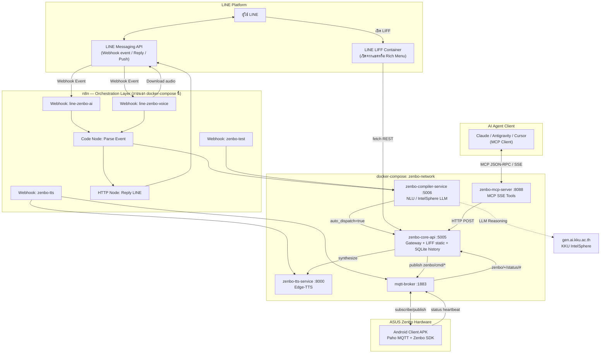
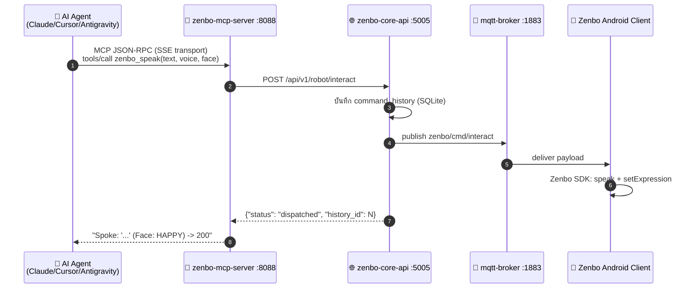
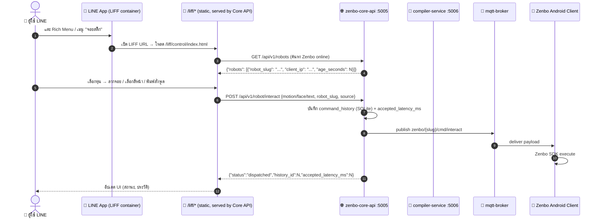
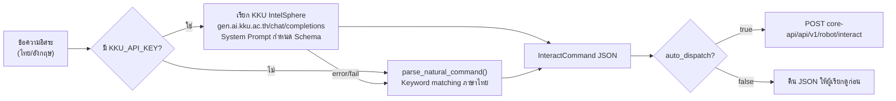
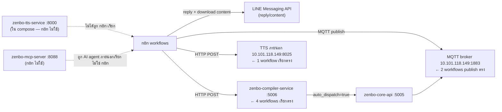

# วิเคราะห์ระบบ Zenbo: n8n เป็นแกนหลัก + LINE ผ่าน MCP และ LIFF

เอกสารนี้วิเคราะห์สถาปัตยกรรมที่ **มีอยู่จริงในโค้ด ณ ปัจจุบัน** ของ `zenbo-hackathon` โดยตั้ง **n8n เป็นศูนย์กลางการประสานงาน (Orchestrator)** และอธิบายว่า LINE เข้าถึงหุ่นยนต์ได้ผ่านสองช่องทางคู่ขนาน คือ **LINE MCP (agentic tool-calling)** และ **LINE LIFF (web app ควบคุมโดยตรง)**

ข้อมูลอ้างอิงจากไฟล์จริง ไม่ใช่แผนที่ยังไม่ implement:
- `services/core-api/main.py` (Gateway, 484 บรรทัด)
- `services/compiler-service/compiler.py` (NLU Compiler, 328 บรรทัด)
- `services/mcp-server/server.py` (MCP Tools, 100 บรรทัด)
- `services/liff-app/` (index, control/, command/, history/)
- `n8n_workflows/*.json` (6 workflow files)
- `docker-compose.yml` (5 services, ยืนยันด้วย `docker compose ps`)
- `zenbo-client-android/` (Android APK บนตัวหุ่นยนต์)

---

## 1. Services ที่รันจริง (ยืนยันด้วย `docker compose ps`)

| Service | Container | Port | สถานะ | หน้าที่ |
|---|---|---|---|---|
| `mqtt-broker` | `zenbo-mqtt-broker` | 1883, 9001(ws) | Up | Message bus กลางระหว่าง Gateway ↔ Android Client |
| `zenbo-tts-service` | `zenbo-tts-service` | 8000 | Up | Edge-TTS synthesizer (ไทย, cache เป็น mp3) |
| `zenbo-core-api` | `zenbo-core-api` | 5005 | Up | REST Gateway + MQTT publisher + เสิร์ฟ LIFF static + SQLite command history |
| `zenbo-compiler-service` | `zenbo-compiler-service` | 5006 | Up | NLU: แปลงข้อความอิสระ → `InteractCommand` JSON (LLM หรือ local fallback) |
| `zenbo-mcp-server` | `zenbo-mcp-server` | 8088 | Up | Model Context Protocol server (SSE transport) เปิด tool ให้ AI agent เรียก |

Network เดียว: `zenbo-network` (bridge) — ทุก service เห็นกันด้วยชื่อ container

**หมายเหตุสำคัญ:** ไม่มี n8n container อยู่ใน `docker-compose.yml` ของโปรเจกต์นี้ — n8n รันอยู่บน infrastructure อื่น (`libn-docker`, n8n instance ที่ `libn.kku.ac.th`) และเรียก service เหล่านี้ผ่าน network หรือ public URL จากภายนอก stack

---

## 2. ภาพรวมสถาปัตยกรรม (n8n เป็นแกนหลัก)



---

## 3. n8n ในฐานะแกนกลาง — Workflow ที่มีอยู่จริง (`n8n_workflows/*.json`)

| ไฟล์ | Webhook Path | หน้าที่ | ปลายทางที่เรียก |
|---|---|---|---|
| `zenbo_line_text_ai_workflow.json` | `line-zenbo-ai` | รับข้อความ LINE → compiler → ตอบ Flex Message | `${COMPILER_SERVICE_URL}/api/v1/compiler/text` → LINE Reply API |
| `zenbo_line_voice_workflow.json` | `line-zenbo-voice` | รับคลิปเสียง LINE → ดาวน์โหลด → compiler/voice → ตอบ Flex Message | LINE Content API → `/api/v1/compiler/voice` → LINE Reply API |
| `zenbo_line_bot_workflow.json` | `line-zenbo-webhook` | เวอร์ชันย่อ (legacy) ของ text workflow | Compiler service เดียวกัน |
| `zenbo_tts_server_workflow.json` | `zenbo-tts` | รับ text ตรง → เรียก TTS `:8025` (server ภายนอก คนละตัวกับ `zenbo-tts-service:8000` ใน compose) → publish MQTT `zenbo/audio` | `10.101.118.149:8025/api/tts/binary` + MQTT broker `Zenbo-Mosquitto-149` |
| `zenbo_connect_booky_workflow.json` | `zenbo-connect` | ส่ง handshake "Bookyพร้อมครับ" ตรงไปยัง MQTT `zenbo/cmd/interact` โดยไม่ผ่าน compiler | MQTT broker ตรง |
| `zenbo_dev_test_workflow.json` | `zenbo-test` | Endpoint ทดสอบ compiler แบบ manual, คืน JSON ดิบเพื่อ debug | Compiler service, ตอบ JSON กลับ (ไม่ยิงเข้า LINE) |

**บทบาทของ n8n ในระบบนี้:**
1. **จุดรับ Webhook เดียวจาก LINE Platform** — LINE ส่ง event ทุกประเภท (text, audio, postback) มาที่ n8n ก่อนเสมอ ไม่มี service ใน docker-compose ที่รับ webhook จาก LINE ตรง
2. **Business Logic Router** — ใช้ Code node (`n8n-nodes-base.code`) แยกประเภท event, กรอง (`Filter Text Only`, `Filter Voice Only`), และแปลง payload ก่อนส่งต่อ
3. **เรียก Compiler Service เป็นสมอง NLU** — ทุก workflow หลัก (text/voice) ยิงไปที่ `zenbo-compiler-service:5006` แล้วให้ compiler เป็นผู้ตัดสินใจว่าจะ `auto_dispatch` เข้า Core API เองหรือไม่
4. **สร้าง LINE Flex Message ตอบกลับ** — ทุก workflow มี Code node สร้าง Flex bubble แสดงข้อความที่หุ่นพูด, สีหน้า, และสถานะ ก่อนยิง `POST https://api.line.me/v2/bot/message/reply`
5. **ทางลัดที่ไม่ผ่าน compiler** — `zenbo_connect_booky` และ `zenbo_tts_server` แสดงให้เห็นว่า n8n สามารถ bypass compiler แล้วคุยกับ MQTT broker ตรงได้เมื่อ logic ง่ายพอ (handshake, TTS เสียงตรง)

**ข้อสังเกตเรื่องความสอดคล้อง (Discrepancy ที่พบจากการอ่านโค้ดจริง):**
- `zenbo_tts_server_workflow.json` เรียก TTS server ที่ `10.101.118.149:8025` ซึ่ง**ไม่ใช่**ตัวเดียวกับ `zenbo-tts-service` ใน `docker-compose.yml` (พอร์ต 8000, ใช้ `edge_tts` เช่นกันแต่เป็น container คนละตัว, มี schema ต่าง — `age`, `natural_mode`) แสดงว่ามี TTS service คู่ขนานอยู่นอก stack นี้ที่ n8n เรียกตรงแทน `zenbo-core-api`
- `zenbo_connect_booky_workflow.json` publish ไปที่ topic `zenbo/cmd/interact` แบบ flat แต่ `zenbo-core-api` เวอร์ชันปัจจุบัน (มี `robot_slug` + `topic_prefix = zenbo/{robot_slug}`) แปลว่า workflow นี้เขียนไว้ก่อนที่ Core API จะรองรับหลายหุ่นยนต์ — จะ handshake ได้เฉพาะ client ที่ subscribe topic prefix เริ่มต้น `zenbo` เท่านั้น ไม่ระบุเครื่องเจาะจง
- Compiler service (`compiler.py`) มี local fallback parser (`parse_natural_command`) ที่รองรับ `head_sequence` (ส่ายหัว) แล้ว แต่ workflow n8n ปัจจุบันไม่ได้ใช้ field นี้ในการสร้าง Flex message (`build-reply` ใน `zenbo_line_text_ai_workflow.json` เช็คแค่ `motion`, `head`, `wheel_lights`, `action`)

---

## 4. ช่องทางที่ 1 — LINE ผ่าน MCP (Agentic Tool-Calling)



### 4.1 MCP Tools ที่เปิดให้เรียกจริง (`services/mcp-server/server.py`)

| Tool | Signature | ปลายทาง |
|---|---|---|
| `zenbo_speak` | `text, voice="female_sweet", face="HAPPY"` | `POST /api/v1/robot/interact` |
| `zenbo_move` | `x=0.0, y=0.0, theta=0.0, speed=2` | `POST /api/v1/robot/interact` (motion) |
| `zenbo_move_head` | `yaw=0.0, pitch=0.0, speed=2` | `POST /api/v1/robot/interact` (head) |
| `zenbo_play_action` | `action_id=22` | `POST /api/v1/robot/interact` (action + face SINGING) |
| `zenbo_set_lights` | `mode="breathing", color="0x00D031"` | `POST /api/v1/robot/interact` (wheel_lights) |
| `zenbo_emergency_stop` | — | `POST /api/v1/robot/stop` |

Transport: `mcp.run(transport="sse")` — ต้องต่อผ่าน SSE endpoint ที่ port 8088 ไม่ใช่ stdio จึงเชื่อมจาก AI client ระยะไกลได้ (ไม่ต้องรันบนเครื่องเดียวกับ MCP server)

**ข้อจำกัดของ MCP tool set ปัจจุบัน:**
- ยังไม่ครอบคลุม field ใหม่ทั้งหมดที่ `InteractCommand` รองรับแล้ว เช่น `voice_profile`, `youtube`, `navigation`, `emotional_action`, `head_sequence`, `behavior`, `vision`, `remote_control` — MCP เปิดแค่ subset พื้นฐาน (speak/move/head/action/lights/stop) ไม่มี tool สำหรับ multi-robot (`robot_slug`) หรือ `zenbo_get_status` ที่เอกสารแผนเดิมพูดถึง (ไม่มีใน `server.py` จริง)
- ไม่มี tool คู่กับ `/api/v1/robots` (list online robots) หรือ `/api/v1/command-history` — Agent ผ่าน MCP มองไม่เห็นว่ามี Zenbo กี่ตัว online หรือประวัติคำสั่งที่ผ่านมา

### 4.2 ความสัมพันธ์ MCP ↔ n8n ↔ LINE

**MCP ไม่ได้เชื่อมกับ LINE โดยตรง** — ไม่มี LINE client library หรือ webhook handler อยู่ใน `mcp-server`. เส้นทางที่ LINE จะได้ประโยชน์จาก MCP มีอยู่ 2 แบบตามโค้ดจริง:

1. **Indirect ผ่าน n8n เป็นสมอง** — n8n workflow (`zenbo_line_text_ai_workflow.json`) ไม่ได้เรียก MCP เลย แต่เรียก compiler service ตรง; MCP เป็น "ประตูสำรอง" สำหรับ AI agent ภายนอก (Claude Desktop, Cursor) ที่ทำงานคู่ขนานกับ LINE ไม่ใช่ chain เดียวกัน
2. **Potential future path** — ถ้า n8n มี MCP-client node (n8n รองรับ MCP node ตั้งแต่เวอร์ชันใหม่) ก็สามารถให้ n8n workflow เรียก `zenbo_speak` ผ่าน MCP แทนการยิง REST ตรงได้ แต่ **ยังไม่พบการ implement จริงใน workflow ปัจจุบัน**

สรุป: ในโค้ดปัจจุบัน MCP กับ LINE เป็น **สองช่องทางคู่ขนานที่ยังไม่เชื่อมกัน** — LINE ใช้ n8n → compiler → core-api; MCP ใช้ AI agent → mcp-server → core-api. ทั้งสองมาบรรจบกันที่ `zenbo-core-api:5005` เท่านั้น

---

## 5. ช่องทางที่ 2 — LINE ผ่าน LIFF (Web App ควบคุมโดยตรง) — วิเคราะห์ละเอียด

LIFF ไม่ใช่หน้าเดียวอีกต่อไป — เป็น **Multi-Page App 4 หน้า** ที่ core-api เสิร์ฟเป็น static files ทั้งหมด (`app.mount("/liff", StaticFiles(directory=LIFF_DIR, html=True))`, `main.py:27`) แต่ละหน้ามี JavaScript ของตัวเอง **ไม่มี shared bundle/state** — ทุกหน้า fetch `/api/v1/robots` ใหม่และเก็บ `selectedRobot` แยกกันเป็น in-memory variable ของตัวเอง (ยกเว้น `control/` ที่ใช้ `sessionStorage` เพื่อจำ robot ข้ามการรีเฟรช)



### 5.1 โครงสร้างหน้า LIFF จริงทั้ง 4 หน้า (`services/liff-app/`)

| Path (mount ที่ `/liff`) | ไฟล์ | บรรทัดโค้ด | บทบาท |
|---|---|---|---|
| `/liff/` | `index.html` | 717 | **Dashboard หลัก**: Connect card, D-Pad พื้นฐาน, Head slider, Face grid (8 หน้า), Dance grid (8 ท่า), Wheel lights ลัด (3 preset), Instant TTS พร้อม Web Speech API, **Advanced SDK Controls แบบเต็ม** (45 RobotFace, Wheel LED 15 pattern, Remote/Behavior, Vision 8 actions) |
| `/liff/control/` | `control/index.html` | 368 | **Joystick real-time**: Pointer-drag joystick 2 วง (ล้อ + หัว) ส่ง `remote_control` ต่อเนื่องทุก 350ms, ปุ่ม D-Pad สำรอง, ช่อง "สั่งด้วยภาษาธรรมชาติ" พร้อม preview-then-confirm |
| `/liff/command/` | `command/index.html` | 223 | **Command Studio**: หน้าเดียวเน้น NLU — พิมพ์/พูดคำสั่งอิสระ → compile-preview → ยืนยันส่ง, มี STOP แยก |
| `/liff/history/` | `history/index.html` | 115 | **Audit log**: อ่าน `command_history` จาก SQLite, กรองตาม robot, แปล payload เป็นข้อความสรุปด้วย client-side `summarize()` |

**ทุกหน้ามีปุ่มนำทางไขว้กัน** (`index` ↔ `control` ↔ `command` ↔ `history`) แต่ **ไม่ส่ง `selectedRobot` ข้ามหน้า** ยกเว้น `control/` ที่เขียนลง `sessionStorage.setItem('zenbo-control-robot', ...)` — ถ้าผู้ใช้กดลิงก์จาก `index` ไป `command` ต้องเลือก Zenbo ใหม่อีกครั้งเสมอ

### 5.2 REST Endpoints ที่ LIFF เรียกจริง (จาก `core-api/main.py`) — ครบทุก endpoint

| Endpoint | Method | เรียกจากหน้าไหน | หมายเหตุ |
|---|---|---|---|
| `/api/v1/robots` | GET | ทั้ง 4 หน้า | Discovery จาก MQTT heartbeat `zenbo/+/status/#`, กรองอายุ ≤ 90s, `index`/`control` poll ซ้ำทุก 10s (`index`) หรือ manual refresh (`control`) |
| `/api/v1/robots/{slug}/connect` | POST | `index` เท่านั้น | ส่ง handshake "Bookyพร้อมครับ" ด้วย `voice_profile: male_child` เจาะจงเครื่อง — คืน `404` ถ้า heartbeat เก่ากว่า 90s |
| `/api/v1/robots/{slug}/stop` | POST | `control`, `command` (เมื่อเลือก robot แล้ว) | ยิง `zenbo/{slug}/cmd/stop`, บันทึก history เป็น `EMERGENCY_STOP_SENT` |
| `/api/v1/robot/stop` | POST | `index` (เมื่อยังไม่เลือก robot) | Broadcast `zenbo/cmd/stop` ทุกเครื่องพร้อมกัน — **จุดอ่อน**: กด STOP ที่ index โดยไม่เลือก robot จะหยุดหุ่นยนต์ทุกตัวในสนามพร้อมกัน |
| `/api/v1/robot/interact` | POST | `index`, `control` (joystick, natural-dispatch), `command` (dispatch) | Endpoint หลัก ครอบคลุมทุก field ของ `InteractCommand` — ทุกหน้าแปะ `source` field ต่างกัน (`liff_control`, `liff_joystick`, `liff_control_natural`, `liff_command`) เพื่อแยกแหล่งที่มาใน history |
| `/api/v1/commands/compile` | POST | `control` (natural-command box), `command` (analyse) | Preview-only — บังคับ `auto_dispatch=False` เสมอที่ตัว endpoint (ไม่ใช่ query param ที่ client ส่งมา) จึงไม่มีทาง bypass ได้จาก frontend |
| `/api/v1/command-history` | GET | `history` เท่านั้น | Query param `robot_slug` + `limit` (1-100) |
| `/api/v1/voice-profiles` | GET | **ไม่มีหน้าไหนเรียกจริง** | endpoint มีอยู่ใน backend แต่ `index.html` hardcode voice options ในตัว `<select>` เอง (6 ตัวเลือกเดียวกัน) — ไม่ได้ fetch จาก API นี้ |
| `/api/v1/navigation/route` | GET | **ไม่มีหน้าไหนเรียก** | เตรียมไว้ใน backend แต่ยังไม่ผูก UI |
| `/api/v1/tts/neural/binary` | POST | **ไม่มีหน้าไหนเรียก** | Client (LIFF) ไม่เล่นเสียงเอง — เสียงเกิดที่ตัวหุ่นยนต์ (Android APK) ผ่าน MQTT/TTS service คนละทาง ไม่ผ่าน browser |

### 5.3 หน้า `index.html` — Dashboard หลัก (รายละเอียดเจาะจุด)

Section ที่สำคัญเกินกว่าที่เอกสารก่อนหน้าครอบคลุม:

1. **Connect card**: `discoverRobots()` เรียกทุก 10 วินาที (`setInterval`) ไม่ใช่ manual — โหลดหน้าทิ้งไว้จะเห็น robot list อัปเดตอัตโนมัติ
2. **Full SDK Control Surface** (section 6, ใช้ `<details>` แบบ collapsible 4 กลุ่ม):
   - **สีหน้าทั้งหมด**: dropdown 45 ตัวเลือก (รวม `_ADV` suffix ทุกอารมณ์) ตรงกับ RobotFace enum เต็มของ Zenbo SDK ไม่ใช่ 8 ปุ่ม emoji ด้านบนที่เป็นทางลัด
   - **Canned/Emotional action**: `sendManualAction()` ส่ง action ID ดิบ, `sendEmotionalAction()` ผูก action + face + duration เข้าด้วยกันเป็น `emotional_action` payload, มี warning ชัดเจนในหน้าเว็บว่า "Action ID ไม่มีชื่อท่าที่ยืนยันใน SDK — ทดสอบทีละ ID ในพื้นที่ปลอดภัย"
   - **Wheel LED ทุก pattern**: 15 pattern (`static, strobing, breath, color_cycle, rainbow, breath_rainbow, comet, rainbow_comet, moving_flash, flash_dash, rainbow_wave, glowing_yoyo, starry, wave, off`) + color picker แบบ HEX + quick-pick 6 สี + side (`both/left/right`) + direction + speed — ตรงกับ `WheelLightsCommand` schema เต็มรูปแบบใน backend (`side`, `direction`, `speed` fields ที่เพิ่มมาใหม่)
   - **Remote control/Behavior**: มีลิงก์ทางลัดไปหน้า `control/` สำหรับจอย แต่ section นี้เองมีปุ่ม behavior แยก 6 ปุ่ม (`look_at_user`, `track_face` เปิด/ปิด, `follow_face` เปิด/ปิด, `follow_object`) ที่หน้า `control/` ไม่มี
   - **Vision**: 8 actions ตรงกับ `VisionCommand` schema (`detect_face`, `detect_person`, `gesture_point`, `recognize_person`, `measure_height`, `cancel_face`, `cancel_person`, `cancel_recognize`)
3. **หมายเหตุความปลอดภัยที่เขียนไว้ในหน้าเว็บเอง** (บรรทัดสุดท้ายของ section 6): "Line follower, IoT binding, dialog-plan/voice enrollment และ sensor raw API ยังไม่เปิดเป็น remote control เพื่อไม่ให้เครื่องเคลื่อนที่หรือเชื่อมอุปกรณ์โดยไม่มี calibration/สิทธิ์เฉพาะ" — เป็น **decision บันทึกในโค้ดจริง** ว่าทำไม UI ไม่ครอบคลุม 100% ของ SDK
4. **Web Speech API**: ใช้ `webkitSpeechRecognition`/`SpeechRecognition` (`lang: 'th-TH'`) แปลงเสียงเป็นข้อความ **ในฝั่ง browser ล้วนๆ ไม่ผ่าน backend** ก่อนส่งเข้า TTS — คนละเส้นทางกับ LINE voice message workflow ที่ต้องอัปโหลดไฟล์เสียงไป ASR ผ่าน n8n

### 5.4 หน้า `control/index.html` — Joystick แบบ Real-time (ซับซ้อนสุดในกลุ่ม LIFF)

จุดที่ต่างจาก `index.html` ชัดเจน:

1. **Pointer-based joystick, ไม่ใช่ปุ่มกด**: ใช้ `pointerdown/pointermove/pointerup/pointercancel` คำนวณ `directionFor(dx, dy, kind)` จาก vector ที่ลากจากจุดศูนย์กลาง — มี dead-zone `< 22px` = `STOP`
2. **Keepalive ทุก 350ms**: ขณะลากจอยค้างไว้ (ไม่ปล่อยนิ้ว) จะส่ง `sendRemote(kind, lastDirection, quiet=true)` ซ้ำทุก 350ms กัน MQTT message หายหรือ client-side timeout — เป็น **fire-and-forget polling ระหว่างลาก** ไม่ใช่ WebSocket
3. **Auto-stop 3 จุด**: (1) `pointerup`/`pointercancel` (2) `pagehide` event (3) `visibilitychange` เมื่อ `document.hidden` — ป้องกันหุ่นยนต์เดินต่อไม่หยุดถ้าผู้ใช้สลับแอปหรือปิดแท็บกลางทาง (ตรงกับ note "ความปลอดภัย" ที่เขียนไว้ในหน้าเว็บ)
4. **`remote_control` payload ต่างจาก `motion`**: ส่ง `{ remote_control: { body: "FORWARD" } }` หรือ `{ remote_control: { head: "UP" } }` เป็น string enum ไม่ใช่ตัวเลข x/y/theta แบบที่ `index.html` ใช้ — สอง schema นี้ควบคุมพฤติกรรมคนละแบบใน SDK (discrete step vs continuous joystick)
5. **Natural command แบบ preview-then-confirm ระดับหน้าเดียวจบ**: `analyseNaturalCommand()` → เก็บ `naturalPayload` ใน JS variable (ไม่ persist) → `dispatchNaturalCommand()` แยก path ถ้า `naturalPayload.emergency` เป็น `true` จะยิง `/stop` endpoint แทน `/interact` — ตรรกะนี้ซ้ำเหมือนกันเป๊ะกับหน้า `command/` (code duplication ระหว่างสองไฟล์ ไม่มี shared JS module)

### 5.5 หน้า `command/index.html` — Command Studio (เวอร์ชันเรียบง่ายกว่า `control/`)

- โครงสร้างเหมือน natural-command section ของ `control/` แต่ **แยกเป็นหน้าเดี่ยว** ไม่มี joystick/D-Pad ปนอยู่
- แสดง `compiler_source` ที่ backend คืนมาจริง (`data.compiler_source === 'kku_intelsphere' ? 'KKU IntelSphere' : 'Local fallback'`) — ยืนยันจาก `compiler.py:136-172` ว่า field นี้มีอยู่จริงและสะท้อนว่า LLM ตอบสำเร็จหรือระบบ fallback ไปใช้ local parser
- มี `<details>` อธิบายข้อจำกัด YouTube ในหน้าเว็บเอง: "ระบบปัจจุบันยังไม่มี YouTube Player callback จึงตรวจ 'เพลงจบ' แบบแม่นยำไม่ได้" — self-documented limitation อีกจุดหนึ่ง

### 5.6 หน้า `history/index.html` — Audit Trail

- Header เขียนคำเตือนตรงไปตรงมา: "แสดงเวลาที่ Gateway รับคำสั่งและส่ง MQTT แล้ว **ไม่ใช่หลักฐานว่าหุ่นยนต์ทำงานเสร็จ**" — ตรงกับ docstring ใน backend (`record_command_history`: "this is an audit of gateway acceptance, not robot completion")
- `summarize(payload)` เป็น client-side heuristic แปล JSON payload เป็นข้อความไทยอ่านง่าย (เช่น เจอ `payload.text` → "พูด: ...", เจอ `payload.remote_control` → "จอย: ...") — ลำดับ if-else 10 เงื่อนไข ครอบคลุม field หลักแต่ยังไม่ครอบ `emotional_action`, `head_sequence`, `navigation` (เจอ field เหล่านี้จะ fallback เป็น "คำสั่ง Zenbo" เฉยๆ)
- แสดง `source` ตรงจาก DB — ทำให้เห็นว่าคำสั่งมาจากหน้า LIFF ไหน (`liff`, `liff_control`, `liff_joystick`, `liff_control_natural`, `liff_command`) เทียบ pattern การใช้งานจริงได้

### 5.7 จุดสำคัญด้าน Multi-robot ผ่าน LIFF

- Discovery (`/api/v1/robots`) และ dispatch (`/api/v1/robot/interact` พร้อม `robot_slug`) ถูกออกแบบให้รองรับ **หลาย Zenbo พร้อมกัน** โดยแยก MQTT topic เป็น `zenbo/{robot_slug}/cmd/*` และ `zenbo/{robot_slug}/status/*`
- ถ้าไม่ระบุ `robot_slug` คำสั่งจะ broadcast ไปที่ topic `zenbo/cmd/*` แบบเดิม (backward compatible กับ client เก่าที่ subscribe topic เดียว) — แต่ `index.html`'s `emergencyStop()` ใช้ path นี้เป็น fallback เมื่อยังไม่เลือก robot ซึ่งหมายถึง **หยุดทุกตัวพร้อมกันโดยไม่เจตนา** ถ้าผู้ใช้ลืมเลือก
- `connect_robot()` ปฏิเสธ (`404`) ทันทีถ้าไม่พบ heartbeat ของ slug นั้นภายใน 90 วินาที — ป้องกัน LIFF หลอกผู้ใช้ว่า "เชื่อมต่อสำเร็จ" กับหุ่นที่ offline จริง
- **ไม่มีการยืนยันตัวตนผู้ใช้ LINE ในคำสั่งเลย** — `robot_slug` เป็น string ที่ client เลือกได้อิสระจาก dropdown, ไม่มีการ map `userId` จาก LIFF context (`liff.getProfile()`) เข้ากับ permission หรือ audit log ก็ไม่เก็บ LINE userId เลย (column `source` ใน SQLite เก็บแค่ชื่อหน้า ไม่ใช่ตัวบุคคล)

### 5.8 ความคลาดเคลื่อนที่พบเพิ่มจากการอ่านโค้ด 4 หน้าเทียบ backend

1. **`/api/v1/voice-profiles` ไม่ได้ใช้จริง** — ถึงแม้ backend สร้าง endpoint และ 6 voice persona ไว้แล้ว แต่ทั้ง `index.html` และหน้าอื่นเลือก hardcode `<option>` เอง ถ้าเพิ่ม voice profile ใหม่ใน backend UI จะไม่เห็นจนกว่าจะแก้ HTML ตรงด้วย
2. **Duplicate NLU widget**: logic "พิมพ์คำสั่ง → compile-preview → confirm-dispatch" ถูกเขียนซ้ำเต็มรูปแบบใน `control/index.html` (บรรทัด 236-301) และ `command/index.html` (บรรทัด 148-218) แบบ copy-paste เกือบทั้งหมด ต่างกันแค่ id ของ DOM element — เสี่ยง bug drift ถ้าแก้ทีละไฟล์ไม่พร้อมกัน
3. **`index.html` มี Vision/Behavior/LED UI ที่ไม่มีในหน้า `control/`** ทำให้ผู้ใช้ต้องสลับกลับไป `index` เพื่อใช้ฟีเจอร์ขั้นสูงระหว่างที่กำลังลากจอยอยู่ที่ `control/` — flow ไม่ liniar สำหรับ operator ที่ต้องการควบคุมทุกอย่างจากหน้าเดียว
4. **History summarize() ไม่ครบทุก field ของ backend schema ปัจจุบัน** — `emotional_action`, `head_sequence`, `navigation` ไม่มี case เฉพาะ ตกไปที่ default "คำสั่ง Zenbo" ทำให้ audit trail อ่านไม่รู้เรื่องสำหรับคำสั่งเหล่านี้

---

## 6. Compiler Service — สมอง NLU ที่ n8n และ LIFF ใช้ร่วมกัน (`services/compiler-service/compiler.py`)



**Endpoints:**
- `POST /api/v1/compiler/text` — `{command, auto_dispatch}` → เรียก LLM หรือ fallback → ถ้า `auto_dispatch=true` จะยิงต่อไป core-api เอง (หรือ `/api/v1/robot/stop` ถ้า compiled JSON มี `"emergency": true`)
- `POST /api/v1/compiler/voice` — รับไฟล์เสียง (multipart) → ASR ผ่าน KKU (ถ้ามี key) → ส่งต่อเข้า `compile_text` แบบ `auto_dispatch=False` → ค่อย dispatch เองถ้าไม่ emergency

**ใครเป็นผู้เรียก compiler:**
1. n8n (`line-zenbo-ai`, `line-zenbo-voice`, `zenbo-test` webhooks) — auto_dispatch=true เกือบทุกกรณี
2. `zenbo-core-api` เอง ผ่าน `/api/v1/commands/compile` (LIFF "command" page) — **บังคับ** `auto_dispatch=False` เสมอ เพื่อให้ preview ก่อน production dispatch แยกจาก n8n อีกที

**Local fallback parser** รองรับคำสั่งไทยแบบ keyword matching: เดินหน้า/ถอยหลัง/เลี้ยวซ้าย-ขวา/หมุนตัว, ก้ม-เงยหน้า, ส่ายหัว (`head_sequence` 4 steps), หยุด (emergency), สีหน้า 6 แบบ, ไฟล้อ 3 สี — ใช้งานได้แม้ไม่มี LLM API key

---

## 7. ตารางเทียบ 2 ช่องทาง LINE

| มิติ | LINE + MCP | LINE + LIFF |
|---|---|---|
| ผู้เรียกจริง | AI Agent ภายนอก (Claude/Cursor) ไม่ใช่ end-user LINE โดยตรง | End-user ในแอป LINE ผ่าน Rich Menu/ลิงก์ — 4 หน้าแยกกัน (`index`, `control`, `command`, `history`) |
| Transport | MCP JSON-RPC over SSE (`:8088`) | HTTPS REST fetch จาก browser ใน LIFF container, joystick ใช้ Pointer Events + 350ms keepalive polling |
| NLU | ไม่มี — Agent ส่ง structured tool call ตรง | มี — compiler service แปลข้อความอิสระ ผ่าน preview-then-confirm ที่ซ้ำกันใน 2 หน้า (`control`, `command`); ปุ่มกดตรงไม่ต้อง NLU (`index`) |
| Multi-robot | ไม่รองรับ (ไม่มี `robot_slug` parameter ใน tools) | รองรับเต็มรูปแบบ (`/api/v1/robots`, `robot_slug` ทุก endpoint) แต่ **เลือกได้อิสระไม่ผูก LINE identity** |
| ประวัติคำสั่ง | ไม่มี tool เข้าถึง `command_history` | มีหน้า `history` เรียก `/api/v1/command-history` ตรง — audit ระดับ "รับคำสั่งแล้ว" ไม่ใช่ "ทำสำเร็จแล้ว" และ `summarize()` ยังไม่ครบทุก field |
| Coverage SDK | Subset (6 tools: speak/move/head/action/lights/stop) | ครบเกือบ 100% ผ่าน `index.html`'s Advanced Controls (45 face, 15 LED pattern, 8 vision action, behavior, emotional action) ยกเว้นที่ตั้งใจปิด (line follower, IoT, dialog-plan, sensor raw) |
| State ข้ามหน้า | N/A (single tool-call ต่อครั้ง) | ไม่มี shared state — เลือก robot ใหม่ทุกครั้งที่เปลี่ยนหน้า ยกเว้น `control/` ใช้ `sessionStorage` |
| จุดเชื่อมกับ n8n | ไม่เชื่อมกันในโค้ดปัจจุบัน (คู่ขนาน) | ไม่เชื่อมกันเช่นกัน — LIFF คุยกับ core-api ตรง ไม่ผ่าน n8n |

**ข้อสรุปสำคัญ:** ทั้ง MCP และ LIFF ไม่ได้พึ่งพา n8n เลยในการทำงาน — ทั้งสองคุยกับ `zenbo-core-api` ตรง. **n8n เป็นแกนหลักเฉพาะเส้นทาง "LINE Messaging (chat) → หุ่นยนต์"** ที่ต้องมี webhook รับ event และ reply กลับไปยัง LINE Platform ซึ่ง MCP และ LIFF ไม่ต้องทำ (MCP ไม่คุยกับ LINE เลย, LIFF เป็น embedded browser ที่ fetch ตรงไม่ต้องผ่าน webhook cycle)

---

## 8. Robot-side: Android Client รับคำสั่งจาก MQTT อย่างไร

หุ่นยนต์ไม่รู้จัก n8n, MCP, หรือ LIFF เลย — รับรู้แค่ MQTT topics ที่ publish มาจาก `zenbo-core-api`:

- **รับคำสั่ง:** `zenbo[/robot_slug]/cmd/interact`, `.../cmd/speak`, `.../cmd/expression`, `.../cmd/motion`, `.../cmd/head`, `.../cmd/head_sequence`, `.../cmd/action`, `.../cmd/lights`, `.../cmd/emotional`, `.../cmd/remote`, `.../cmd/behavior`, `.../cmd/vision`, `.../cmd/youtube`, `.../cmd/stop`
- **ส่ง heartbeat:** `zenbo/{slug}/status/#` ที่ core-api subscribe (`zenbo/+/status/#`) แล้วเก็บลง `robot_registry` in-memory (TTL 90 วินาที) เพื่อให้ `/api/v1/robots` ตอบได้

ทุกช่องทาง (n8n/LINE, MCP, LIFF) สุดท้ายมาบรรจบที่จุดเดียว: **`zenbo-core-api` publish MQTT topic เดียวกัน** — นี่คือจุดรวมความจริงเดียว (single source of truth) ของระบบ ไม่ว่าจะมาจากช่องทางไหน

---

## 9. ความเสี่ยง/สิ่งที่ควรตรวจก่อนใช้งานจริง

1. **TTS สองระบบซ้อนกัน** — `zenbo-tts-service:8000` (ใน compose) กับ TTS server ภายนอก `10.101.118.149:8025` (ที่ n8n เรียกตรงใน `zenbo_tts_server_workflow.json` และ Android client เรียกตรงผ่าน `TtsClient.java`) เป็นคนละตัว มี schema ต่างกัน (`age`, `natural_mode`) — ต้องตัดสินใจว่าจะรวมเป็นตัวเดียวหรือคงคู่ขนานไว้โดยตั้งใจ
2. **MCP tool set ล้าหลัง Core API** — Core API มี field ใหม่ (`voice_profile`, `youtube`, `navigation`, `emotional_action`, `robot_slug`) แต่ `mcp-server/server.py` ยังเป็นเวอร์ชันพื้นฐาน 6 tools — Agent ผ่าน MCP ควบคุมหุ่นยนต์ได้ไม่เต็มความสามารถเทียบกับ LIFF
3. **n8n workflow บางตัวเขียนก่อนมี multi-robot** — `zenbo_connect_booky_workflow.json` publish topic แบบ flat ไม่ผ่าน `robot_slug` จะไม่ทำงานถูกต้องถ้าในสนามมี Zenbo มากกว่า 1 ตัว
4. **Auth ที่ยังไม่เห็นในโค้ด** — Webhook n8n (`responseMode: onReceived`) ไม่ได้ตรวจ LINE Signature (`x-line-signature`) ในโค้ดที่อ่านได้จาก JSON node parameters ที่ตรวจสอบ ควรยืนยันว่ามีการเช็ค signature อยู่ใน n8n credential/setting จริงหรือยังต้องเพิ่ม
5. **Core API ไม่ auth คำสั่ง `/api/v1/robot/interact`** — Endpoint เปิด CORS `*` และไม่มี API key check ในไฟล์ `main.py` ที่อ่านได้ ใครก็ตามที่เข้าถึง `:5005` ยิงคำสั่งควบคุมหุ่นยนต์ได้ทันทีโดยไม่ต้องผ่าน LINE/n8n/MCP เลย
6. **LIFF ไม่ผูก LINE identity กับคำสั่งเลย** — ไม่มีหน้าไหนเรียก `liff.getProfile()` หรือส่ง LINE `userId` ไปกับ payload; `robot_slug` เลือกได้อิสระจาก dropdown, SQLite `source` column เก็บแค่ชื่อหน้า (`liff_control`, `liff_joystick`) ไม่ใช่ตัวบุคคล — **ไม่สามารถสอบกลับได้ว่าใครสั่งอะไรจากแอป LINE เครื่องไหน**
7. **`emergencyStop()` ที่ `index.html` broadcast ทุกเครื่องโดยไม่ตั้งใจได้ง่าย** — ถ้าผู้ใช้ยังไม่เลือก robot แล้วกด STOP ที่หน้าหลัก ระบบ fallback ไป `/api/v1/robot/stop` (ไม่มี `robot_slug`) ซึ่งยิง `zenbo/cmd/stop` แบบ broadcast หยุดทุก Zenbo ในสนามพร้อมกัน ต่างจากพฤติกรรมที่ผู้ใช้คาดหวัง (หยุดแค่ตัวที่กำลังดูอยู่)
8. **Code duplication ระหว่าง `control/index.html` และ `command/index.html`** — logic "compile-preview → confirm-dispatch" เขียนซ้ำเกือบทั้งหมด (คนละไฟล์, ไม่มี shared module) เสี่ยง bug drift เมื่อแก้ endpoint หรือ error-handling ฝั่งใดฝั่งหนึ่งแล้วลืมอีกฝั่ง
9. **`/api/v1/voice-profiles` เป็น dead code จากมุมมอง frontend** — backend สร้าง endpoint และ 6 persona ไว้ แต่ไม่มีหน้า LIFF ไหน fetch จริง (hardcode `<option>` เอง) — เพิ่ม/แก้ voice profile ที่ backend จะไม่มีผลกับ UI จนกว่าจะแก้ HTML คู่กัน
10. **`history/index.html`'s `summarize()` อ่านไม่ครบ field ใหม่** — `emotional_action`, `head_sequence`, `navigation` ไม่มี case เฉพาะ ตกไปที่ "คำสั่ง Zenbo" generic — audit trail ใช้ debug คำสั่งเหล่านี้ไม่ได้จากหน้า UI ต้องดู `payload` JSON ดิบเอง

---

## 10. สรุปเส้นทางข้อมูลแบบย่อ (Data Flow Summary)

```
LINE Chat (text/voice)  → n8n webhook → compiler-service → core-api → MQTT → Zenbo APK
                                                                ↑
LINE LIFF (web app)     → fetch REST ──────────────────────────┘
                                                                ↑
AI Agent (MCP client)   → mcp-server → core-api ────────────────┘

Zenbo APK → MQTT status heartbeat → core-api (robot_registry) → /api/v1/robots → LIFF discovery
```

จุดร่วมเดียวของทุกช่องทาง: **`zenbo-core-api:5005`** ทำหน้าที่ทั้ง (1) MQTT publisher/subscriber (2) SQLite command history ledger (3) LIFF static file server (4) REST gateway ให้ MCP และ n8n เรียก — เปลี่ยนแปลง logic ควบคุมหุ่นยนต์ที่จุดนี้จุดเดียวจะกระทบทุกช่องทางพร้อมกัน

---

## 11. Service ใดบ้างที่ n8n เรียกใช้จริง (n8n-as-orchestrator inventory)

จากการไล่ node `type: "n8n-nodes-base.httpRequest"` และ `n8n-nodes-base.mqtt` ใน `n8n_workflows/*.json` ทั้ง 6 ไฟล์ สรุปได้ว่านี้คือ service ที่ **n8n เรียกตรง** (ไม่นับ service ที่ถูกเรียกต่อผ่าน chain):

### 11.1 Service ที่ n8n เรียกโดยตรง (Direct calls)

| Service | URL ที่ n8n เรียก | ผ่าน workflow ไหน | จำนวน workflow |
|---|---|---|---|
| **zenbo-compiler-service** (`:5006`) | `$env.COMPILER_SERVICE_URL/api/v1/compiler/text` หรือ `http://zenbo-compiler-service:5006/api/v1/compiler/text` | text AI, voice (`/voice`), line bot, dev test | 4 |
| **TTS server ภายนอก** (`10.101.118.149:8025`) | `POST /api/tts/binary` | tts_server | 1 |
| **MQTT broker** (`Zenbo-Mosquitto-149` → `10.101.118.149:1883`) | `mqtt` node publish `zenbo/audio`, `zenbo/cmd/interact` | tts_server, connect_booky | 2 |
| **LINE Messaging API** (ภายนอก) | `POST https://api.line.me/v2/bot/message/reply`, `GET api-data.line.me/.../content` | text AI, voice | 2 |

### 11.2 Service ใน docker-compose ที่ n8n **ไม่** เรียกตรง (เข้าถึงแบบ transitively หรือไม่ถูกใช้เลย)

| Service | ทำไม n8n ไม่เรียกตรง |
|---|---|
| **zenbo-core-api** (`:5005`) | n8n ไม่ได้ยิง `/api/v1/robot/interact` ตรง — คำสั่งถูกส่งผ่าน compiler service (`auto_dispatch=true`) ซึ่ง compiler เป็นฝ่ายเรียก core-api ต่ออีกที เป็น **transitive dependency** ไม่ใช่ direct |
| **zenbo-tts-service** (`:8000`, ใน compose) | n8n เรียก TTS server **คนละตัว** ที่ `:8025` (มี schema ต่างกัน: `age`, `natural_mode`) ไม่ใช่ตัว `zenbo-tts-service` ใน compose — เท่ากับ TTS ใน compose นี้ n8n ไม่ได้ใช้เลย |
| **zenbo-mcp-server** (`:8088`) | ไม่มี workflow ไหนเรียก MCP node หรือ `/sse` — MCP ถูกใช้โดย AI agent ภายนอก (Claude/Cursor) ไม่ใช่ n8n |

### 11.3 สรุปภาพ n8n จริง



**ข้อเท็จจริงสำคัญที่ได้จากการวิเคราะห์:**

1. **n8n เป็น orchestrator เฉพาะชั้น "อินเทอร์เฟซ" ไม่ใช่ชั้น "แกนควบคุม"** — งานจริงที่ n8n ทำคือ (a) รับ LINE webhook (b) เรียก compiler เพื่อแปลงภาษา → JSON (c) ตอบ LINE ด้วย Flex message และ (d) บางงาน publish MQTT ตรงเท่านั้น
2. **จุดศูนย์กลางควบคุมหุ่นยนต์จริงคือ `zenbo-core-api`** แต่ n8n เข้าถึงแบบอ้อมผ่าน `auto_dispatch` ของ compiler — n8n ไม่เคยเห็น `/api/v1/robot/interact`, `robot_registry`, หรือ `command_history` เลย
3. **TTS สองระบบแยกกันชัดเจน**: n8n ใช้ `:8025` (schema `age`/`natural_mode`), ส่วน compose ใช้ `:8000` (schema `rate`/`pitch`) — แสดงว่ามี TTS stack คู่ขนานที่ยังไม่ถูกรวม และ n8n ผูกกับตัวนอก compose ไม่ใช่ตัวใน compose
4. **MCP อยู่นอกเส้นทาง n8n โดยสิ้นเชิง** — ถ้าเป้าหมายคือ "ทุกอย่างผ่าน n8n เป็นหลัก" ช่องว่างนี้คือสิ่งที่ต้องแก้: ปัจจุบัน MCP ↔ core-api ตรงโดยไม่ผ่าน n8n, และ n8n ↔ core-api ก็อ้อมผ่าน compiler ไม่มี node ที่ n8n เรียก core-api ตรง

### 11.4 สิ่งที่ต้องทำถ้าต้องการให้ "n8n เป็นหลัก" อย่างแท้จริง

| ปัจจุบัน | เป้าหมาย n8n-centric | การแก้ไข |
|---|---|---|
| n8n → compiler → core-api (auto_dispatch) | n8n → core-api ตรง | เพิ่ม HTTP Request node ใน workflow เรียก `/api/v1/robot/interact` พร้อม `robot_slug` (n8n ควบคุม multi-robot ได้เอง) |
| MCP → core-api ตรง | MCP → n8n → core-api | เพิ่ม MCP client node ใน n8n (n8n รองรับ MCP node) ให้ n8n เป็น proxy กลางระหว่าง agent กับ robot |
| n8n ไม่รู้ `command_history`/`/api/v1/robots` | n8n เป็นศูนย์ audit/dispatch | เพิ่ม workflow ที่เรียก `/api/v1/command-history` และ `/api/v1/robots` เพื่อทำสถานะ/รายงาน |
| n8n ใช้ TTS `:8025` ตรง | n8n ใช้ TTS ใน stack เดียว | เปลี่ยน URL ใน `zenbo_tts_server_workflow.json` ไปที่ `zenbo-tts-service:8000` หรือ `/api/v1/tts/neural/binary` ผ่าน core-api |
