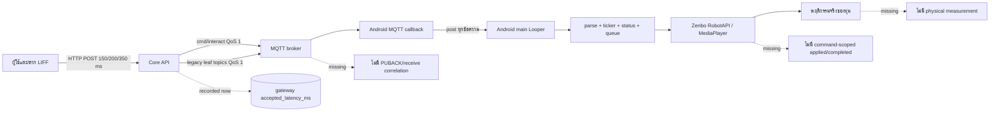

# Zenbo Control Performance และ LIFF UX/UI Analysis

- วันที่วิเคราะห์: 4 กันยายน 2026 (Asia/Bangkok)
- สถานะเอกสาร: Analysis only — พร้อมใช้เป็นแผนพัฒนารอบถัดไป
- ขอบเขต: Android APK, Core API/MQTT, log ย้อนหลัง และ `https://lib.kku.ac.th/liff/***`

> เอกสารนี้ยังไม่แก้โค้ด ไม่ build/deploy APK ไม่ส่งคำสั่ง MQTT/API ไปยัง Zenbo และไม่ทดสอบการเคลื่อนไหวจริง การเปิดหน้าเว็บและการอ่าน API ที่ใช้ใน audit เป็น read-only เท่านั้น

## 1. ข้อสรุปสำหรับตัดสินใจ

การทำให้ Zenbo “เร็วและ smooth” ไม่ควรเริ่มจากเพิ่มระดับความเร็วล้อ แต่ควรแก้ command pipeline ก่อน เพราะหลักฐานปัจจุบันพบการส่ง keepalive ถี่หลายแบบ, การขยายหนึ่ง request เป็น MQTT หลาย topic, ไม่มี `command_id`/sequence/deadline แบบ end-to-end, งาน parse/UI/audio จำนวนมากเข้า Android main thread และไม่มีเวลาวัดถึง SDK/พฤติกรรมจริง

ลำดับที่แนะนำคือ:

1. เพิ่ม trace และล็อก version ของ APK ที่ทดสอบให้ตรงกับ source
2. ทำคำสั่งให้ idempotent พร้อม priority queue แบบ STOP-first และ latest-wins สำหรับ remote control
3. ลดงานซ้ำระหว่าง REST → MQTT → APK และย้าย parse/Base64/file I/O ออกจาก main thread
4. แก้ P0 ของ `/liff/control/` และ `/liff/teleop/` ก่อนปรับหน้าตาเพิ่มเติม
5. แยก TTS/audio/gesture ออกจากช่องควบคุม และผูก animation กับ playback session จริง
6. ทดสอบ offline/fake MQTT ให้ครบ แล้วจึงทำ safety-gated field test บนหุ่นจริงหนึ่งรอบ

### 1.1 สิ่งที่ควรทำก่อนตามลำดับความสำคัญ

| ระดับ | งาน | เหตุผล | ผลที่คาดหวัง |
| --- | --- | --- | --- |
| P0 | เพิ่ม `command_id`, `source_session_id`, `source_seq`, `created_at`, `expires_at` และ timestamp ทุก boundary | ตอนนี้แยก deliberate keepalive, QoS1 replay และคำสั่งซ้ำจริงไม่ได้ | วัด end-to-end ได้และไม่ execute ซ้ำ |
| P0 | สร้าง APK scheduler: STOP/safety > direction change > normal; remote queue ขนาด 1 แบบ latest-wins | keepalive ทุก 150/200/350 ms เดินผ่าน REST/MQTT/main thread แม้ทิศไม่เปลี่ยน | ลด backlog และอาการกระตุก |
| P0 | แก้ layout `/liff/control/` และ API/state ของ `/liff/teleop/` | ปุ่มสำคัญถูกตัดนอกจอ และ teleop ได้ 404 แต่ยังเปิด controls | ควบคุมได้จริงและปลอดภัยบนมือถือ |
| P0 | ทำ MQTT connection ให้ Service เป็น owner เดียวและ connect แบบ idempotent | production log พบ session ซ้อน 17 ครั้งและ 5 commands ถูก fan-out ไปสอง client | ลด reconnect race/double subscribe/duplicate delivery |
| P0 | แยก TTS/Base64/audio I/O ออกจาก control path/main thread พร้อม bounded queue/cancel | production speech p95 9,644 ms/max 30,018 ms; APK มี queue ไม่จำกัดและเขียนไฟล์ synchronous | STOP/remote ไม่ถูกรบกวนจากงานเสียง |
| P0 release | ถอนและ rotate MQTT credential ที่ฝังใน working source/APK; กลับไปใช้ per-device provisioning | เป็น release blocker ไม่ใช่ optimization | ป้องกัน credential reuse/leak |
| P0 safety | ห้ามปิด safety/เพิ่ม L7 เพื่อแก้ “ช้า”; เปิด motion เฉพาะเมื่อ heartbeat และ field gate ผ่าน | latency และ physical speed เป็นคนละปัญหา | ปรับความลื่นโดยไม่เพิ่มความเสี่ยง |
| P1 | ทำ resource ownership สำหรับ base/head/face/action/audio/camera | gesture/manual/sequence สามารถแย่งทรัพยากรกัน | การเคลื่อนไหวและสีหน้าต่อเนื่องขึ้น |
| P1 | ปรับ LIFF status เป็น Gateway accepted → APK received → SDK applied/rejected | UI ปัจจุบันถือ HTTP success เป็น “ส่งแล้ว” | ผู้ใช้รู้จุดที่ล่าช้าหรือหลุดจริง |
| P2 | lazy-load 3D, compile CSS, แยกหน้าใหญ่เป็นโมดูล | ลดเวลาโหลดและ DOM/UI churn แต่ไม่ใช่คอขวดอันดับแรกของ remote | หน้าแรกเปิดเร็วและดูแลง่ายขึ้น |

## 2. วิธีวิเคราะห์และระดับความเชื่อมั่น

งานถูกแยกให้ sub-agent ตรวจพร้อมกัน 3 สายแบบ read-only:

- APK latency/concurrency: Android service, MQTT, TTS/audio, gesture และ lifecycle
- Historical logs: SQLite command history, Mosquitto, n8n และ development loop log
- LIFF UX/UI: live browser, mobile/desktop layout, console/network และ source mapping

หลักฐานที่ใช้:

- working tree ปัจจุบันของ `services/core-api`, `services/liff-app` และ `zenbo-client-android`
- `data/command_history.sqlite3` แบบ aggregate โดยไม่คัดลอกข้อความ/PII
- `mosquitto/log/mosquitto.log`, n8n event/database และ `docs/LOOP_LOG.md`
- production command DB และ Docker logs ของ Core/Mosquitto/TTS/Nginx แบบ aggregate/sanitized snapshot โดยไม่คัดลอก payload, IP, token หรือข้อมูลผู้ใช้
- browser readback วันที่ 4 กันยายน 2026 บนหน้า live โดยเน้น viewport 390×844, 768 px และ 1440 px
- smoke check หน้า LIFF ทั้ง 12 route และ functional/network check หน้าควบคุมหลัก

ตัวเลข production เป็น snapshot ประมาณ 16:32–16:36 BKK วันที่ 4 กันยายน 2026; log เป็นข้อมูลที่ยังเดินต่อได้ จึงต้องบันทึก cutoff ใหม่ทุกครั้งที่นำ baseline ไปเปรียบเทียบ

### 2.1 Provenance ที่ต้องล็อกก่อนพัฒนา

| ชั้น | หลักฐานปัจจุบัน | ข้อจำกัด |
| --- | --- | --- |
| Source Android | HEAD `05dc6b6023bc68602e88e9c302ac0b865d3962fa`; working source ระบุ `1.9.48`, `versionCode 724` | working tree ยังไม่ commit และต่างจาก HEAD จำนวนมาก |
| Field/runtime evidence | หลักฐานที่เก็บไว้ชี้ไปยัง APK `1.9.32/1.9.34` | ยังใช้สรุปอาการของ source `1.9.48` โดยตรงไม่ได้ |
| Local command DB | 238 rows, 30 ส.ค. 2026 11:56:50–13:42:55 BKK | เก่ากว่าเหตุภาคสนามวันที่ 2–4 ก.ย. |
| Production history | 4,077 rows, 30 ส.ค. 07:00:46Z–4 ก.ย. 05:51:28Z | วัด Core acceptance เท่านั้น ไม่มี APK/SDK/physical timestamp |
| Production broker log | 81,341 lines, 31 ส.ค. 03:07:03Z–4 ก.ย. 09:32:05Z | พิสูจน์ connection/fan-out ได้ แต่ไม่มี physical result |
| Local broker log ที่เก็บไว้ | จบที่ 2 ก.ย. 21:35 BKK | ไม่พบ Android client/topic timing |
| Physical result | ไม่มี field measurement ในรอบนี้ | ห้ามอ้างว่า RobotAPI/ล้อ/เสียงเร็วขึ้นแล้ว |

ดังนั้นข้อค้นพบเชิงโครงสร้างจาก source มีความเชื่อมั่นสูง แต่การบอกว่าแต่ละจุดเป็นสาเหตุของอาการบนหุ่นรุ่นที่ติดตั้งอยู่มีความเชื่อมั่นปานกลางหรือต่ำจนกว่าจะติดตั้ง APK ที่ระบุ hash/version เดียวกันและเก็บ trace ครบเส้นทาง

## 3. เส้นทางคำสั่งปัจจุบันและช่องว่างการวัด



`accepted_latency_ms` ถูกคำนวณก่อนเขียน history และหมายถึง “Gateway รับ request และเรียก publish แล้ว” เท่านั้น ไม่ใช่ MQTT PUBACK, APK receive, SDK applied หรือหุ่นขยับจริง แม้ UI แสดง `0 ms` ก็ไม่ได้แปลว่าหุ่นตอบสนองใน 0 ms

### 3.1 Timestamp ที่ต้องเพิ่ม

| Boundary | Field ที่เสนอ | Clock |
| --- | --- | --- |
| LIFF input | `input_at_client_ms`, `source_seq` | wall + monotonic pair |
| Core receive | `gateway_received_at_ms` | server wall/monotonic |
| MQTT accepted/PUBACK | `mqtt_publish_at_ms`, `mqtt_puback_at_ms` | Core monotonic |
| APK callback | `apk_received_at_ms` | Android elapsed realtime |
| Scheduler | `apk_scheduled_at_ms`, queue depth/drop reason | Android elapsed realtime |
| SDK call | `sdk_invoked_at_ms`, resource owner | Android elapsed realtime |
| SDK callback/player | `sdk_state`, `playback_started/completed_at_ms` | Android elapsed realtime |
| Field observation | `operator_observed_at_ms` หรือ sensor evidence | แยกจาก software ACK |

ทุก status/error ต้องมี `command_id`; duration ข้ามเครื่องควรคำนวณอย่างระวังเรื่อง clock skew และเก็บ per-hop monotonic duration ควบคู่กัน

Log ต้องเก็บ metadata แบบจำเป็นเท่านั้น เช่น pseudonymous robot key, software version, command type/result และ queue/connection metrics หากต้องมี HMAC ให้สร้างจาก canonical allow-listed non-PII fields เท่านั้น พร้อม key rotation/retention policy; ห้ามนำข้อความ TTS หรือ payload เต็มเข้า HMAC และห้าม log MQTT payload 200 ตัวแรก, ชื่อ, IP หรือ credential

## 4. ผลวิเคราะห์ log ย้อนหลัง

### 4.1 Local command history

ฐานข้อมูล `data/command_history.sqlite3` มี 238 แถวในช่วง 1 ชั่วโมง 46 นาที:

- `MQTT_PUBLISHED` 235 แถว และ `EMERGENCY_STOP_SENT` 3 แถว
- `liff` 173 แถว, `liff_joystick` 53, `liff_present` 7, `liff_command` 4 และ `liff_control` 1
- 223 แถวมี `remote_control`, 10 speech, 4 motion, 5 head, 2 action และ 9 lights (field อาจซ้อนกันได้)
- Gateway accepted latency ทั้ง 235 แถว: min 0 ms, mean 15.9 ms, p50 1 ms, p95 5 ms, p99 19 ms, max 3,624 ms
- เฉพาะ remote 223 แถว: mean 0.2 ms, max 5 ms
- เฉพาะ speech 10 แถว: mean 369.7 ms, max 3,624 ms
- มี exact duplicate payload 14 กลุ่ม รวมแถวส่วนเกิน 218 แถว; กลุ่มใหญ่สุด 106 แถว
- remote gap: 32 ช่วงต่ำกว่า 100 ms, 31 ช่วง 100–249 ms, 126 ช่วง 250–499 ms และ 33 ช่วงตั้งแต่ 500 ms ขึ้นไป
- พบ same-direction ภายใน 500 ms จำนวน 135 ครั้ง
- ไม่มี `command_id` ใน 235 แถวที่ publish MQTT

ความหมาย:

- Core path ของ remote ใน snapshot นี้เร็วอยู่แล้ว จึงยังไม่มีหลักฐานว่าเพิ่ม CPU/ปรับ FastAPI จะทำให้ล้อ smooth ขึ้น
- burst และ duplicate สอดคล้องกับ keepalive ที่ตั้งใจส่ง แต่ไม่มี ID/sequence จึงแยก transport replay หรือ duplicate execution ไม่ได้
- outlier ของ speech สอดคล้องกับการรอ TTS ก่อน publish แต่ sample มีเพียง 10 ครั้ง
- SQLite ชุดนี้ไม่ครอบคลุมเหตุวันที่ 2–4 ก.ย. จึงเป็น pattern evidence ไม่ใช่ causal proof

### 4.2 Production command history และ live history

production DB มี 4,077 rows; ในจำนวนนี้ 4,013 rows เป็น `MQTT_PUBLISHED`:

- รวม: min 0 ms, p50 0 ms, p95 1 ms, p99 357 ms, max 30,018 ms
- Remote control 2,462 rows: p50 0 ms, p95 0 ms, p99 1 ms, max 3 ms
- Text/speech 125 rows: p50 1 ms, p95 9,644 ms, p99 14,727 ms, max 30,018 ms
- จำนวนต่อวัน UTC: 30 ส.ค. 1,310; 1 ก.ย. 597; 2 ก.ย. 355; 3 ก.ย. 183; 4 ก.ย. 1,632 rows ก่อน 05:51Z
- peak รวม 14 commands/s และ 165 commands/min
- แบ่ง remote session ด้วย gap >2.5 s ได้ 131 sessions; commands/session p50 9, p95 86, max 208
- burst ใหญ่สุด 208 commands ใน 75.1 s; burst เร็ว 126 commands ใน 22.9 s หรือเฉลี่ย 5.50/s
- adjacent identical-payload ภายใน 500 ms มี 1,894 คู่; ภายใน 1.5 s 2,445 คู่; ภายใน 10 s 3,012 คู่
- เมื่อตัด `liff_joystick` ออก ยังมี identical pairs ภายใน 500 ms 771 คู่

ตัวเลข duplicate เป็นสัญญาณ burst/duplication ไม่ใช่หลักฐานว่า Zenbo execute ซ้ำทั้งหมด เพราะ keepalive จำนวนมากเป็น intentional และไม่มี command ID ให้แยก replay

หน้า live `/liff/history/` แสดงข้อมูลชุดเดียวกัน 4,077 รายการ 204 หน้า ณเวลาที่ audit:

- sample ล่าสุด 20 แถวอยู่ราว 4 ก.ย. 12:51:24–12:51:28 BKK
- ทั้ง 20 เป็น `liff_joystick`, แสดง `0 ms` และเกิดประมาณ 5 ครั้ง/วินาที
- หน้าสุดท้ายมี 17 แถว; แถวเก่าสุดที่เห็นคือ 30 ส.ค. 14:00:46 BKK
- UI ใช้คำว่า “Gateway รับคำสั่ง” และ “เวลา API” แต่ badge “ส่ง MQTT แล้ว” ยังอาจถูกผู้ใช้เข้าใจว่า Zenbo ทำงานแล้ว

ควรเปลี่ยน history จาก single status เป็น command timeline และเก็บ keepalive แบบ aggregate เพื่อลด write volume:

```text
CLIENT_SENT → GATEWAY_ACCEPTED → MQTT_ACKED → APK_RECEIVED
            → SDK_APPLIED / REJECTED → COMPLETED (software) → FIELD_CONFIRMED (optional)
```

สำหรับ continuous control ให้บันทึก direction transition, STOP, error และ summary ต่อ session แทน full payload ทุก 150–350 ms แต่ต้องคง durable audit ของ STOP/safety ไว้

### 4.3 Production Mosquitto: พบ session ซ้อนและ fan-out สอง client

จาก production Docker log:

- robot-client successful connect 107 เหตุการณ์, disconnect record 118 เหตุการณ์
- พบ connect ใหม่ขณะที่ session เดิมยัง active 17 ครั้ง
- session duration: min 0 s, p50 163 s, p95 3,012 s, max 11,003 s
- สาเหตุ disconnect: ไม่ระบุ 50, client ปิดเอง 46, keepalive timeout 11 และ not-authorised 11
- Core gateway connect 85 ครั้งใน log window
- heartbeat 4,870 ครั้งในช่วง 4 ก.ย. 02:13:02Z–09:07:53Z; gap p50 5 s, p95 5 s, p99 6 s, max 306 s
- heartbeat gap >7.5 s มี 12, >10 s มี 8, >30 s มี 4 และ >90 s มี 1
- read-only API snapshot ณเวลาตรวจพบ online robot = 0

จาก command receive 3,353 events:

- ไม่มี subscriber ขณะส่ง 227 commands
- fan-out ไปหนึ่ง client 3,121 commands
- fan-out ไปสอง client ของ robot slug เดียวกัน 5 commands

หลักฐานนี้ยืนยันว่า broker เคยส่งคำสั่งเดียวไปสอง MQTT client จริง แต่ยังยืนยันไม่ได้ว่าหุ่นทำจริงสองรอบ เพราะมี status กลับเพียงเส้นเดียวและไม่มี correlated `action_done`/physical timestamp

### 4.4 TTS, Nginx, local logs, n8n และ loop log

- production TTS log: `/api/tts/binary` ได้ 200 จำนวน 1,021 ครั้งและ 500 จำนวน 12 ครั้ง; legacy route สองรูปแบบรวม 110 ครั้งได้ 404
- production LIFF Nginx log 11,127 requests: 200=10,798; 401=217; 404=23; 409=3; 499=1; 502=21; 504=6
- `/api/v1/robots` ราว 8,070 requests, polling gap p50 3.999 s และมี 617 gaps ต่ำกว่า 0.5 s จากหลาย tab/page loop; access format ไม่มี request duration
- Core container log ที่เหลือมีเพียงราว 190 lines หลัง container recreation จึงไม่ใช่ full history
- `mosquitto/log/mosquitto.log` ที่เก็บไว้มี broker start/terminate/reconnect ของ Core/test clients ระหว่าง 29 ส.ค.–2 ก.ย. แต่ไม่พบ client ที่ยืนยันว่าเป็น Android `booky-1`
- n8n event log สองไฟล์มีขนาด 0 bytes และตาราง execution ที่ตรวจไม่มี run จึงไม่มี timing evidence
- `docs/LOOP_LOG.md` บันทึก build/deploy/smoke/67 Core tests แต่ baseline row ระบุ “Metrics not recorded” และยังแยก APK install/heartbeat/physical result ไม่ครบ

ข้อสรุปคือ production log พิสูจน์ TTS delay, overlapping MQTT sessions และ broker fan-out ได้แล้ว แต่ยังพิสูจน์ไม่ได้ว่า delay/duplicate หลัง APK receive อยู่ที่ scheduler, RobotAPI หรือ mechanics ต้องเพิ่ม command-scoped trace และเก็บ `adb logcat` จาก APK version เดียวกับ source ใน field testรอบถัดไป

## 5. APK: จุดที่ควรปรับ

### 5.1 P0 — Command identity, deduplication และ compatibility

สิ่งที่พบ:

- Android model มี `command_id` แต่ Core request/payload ไม่ส่ง field นี้
- Core ส่งทั้ง composite `cmd/interact` และ legacy leaf เช่น `cmd/remote`, `cmd/safety`, `cmd/volume`
- APK suppress leaf ด้วย time window 1.5 วินาที ไม่ใช่ idempotency; บาง leaf ไม่อยู่ใน suppression list
- QoS 1 อนุญาต redelivery แต่ไม่มี LRU/TTL dedupe ต่อ command

ข้อเสนอ:

- Core เป็นผู้สร้าง UUID `command_id` หาก client ไม่ส่ง และ echo กลับทุก ACK/status/history
- เพิ่ม `source_session_id`, monotonic `source_seq`, `created_at_ms`, `expires_at_ms` และ `capabilities_version`
- APK เก็บ bounded LRU ของ command ID พร้อม TTL; drop expired/out-of-order command โดยรายงานเหตุผล
- client รุ่นใหม่ subscribe/execute composite เท่านั้น; publish legacy leaves เฉพาะเมื่อ capability ของ APK ระบุว่าต้องใช้
- rollout แบบ backward-compatible: dual publish เฉพาะ robot ที่ยังเป็น legacy ไม่ใช่ทุก request

### 5.2 P0 — Bounded priority scheduler

ลำดับ priority ที่เสนอ:

1. `EMERGENCY_STOP`, sensor stop และ safety interlock — preempt ทุก queue
2. remote direction transition และ release STOP
3. head/face/manual action ที่ผู้ใช้เพิ่งสั่ง
4. scenario/background action
5. speech/audio/cache/prefetch

นโยบาย queue:

- base/head remote เป็น latest-wins queue ขนาด 1 ต่อ resource
- keepalive ต่อ lease เท่านั้น ไม่ restart ticker/parse composite ซ้ำหรือเรียก RobotAPI ซ้ำเมื่อทิศเดิม
- speech queue ต้องมีขนาดสูงสุด, cancel/replace policy และ session generation
- STOP ต้อง bypass งาน TTS/audio และ flush remote work ที่ค้าง
- RobotAPI call ยังต้องเคารพ threading contract ของ Zenbo SDK: parse/decode/file I/O ทำ worker thread แล้ว marshal เฉพาะ SDK call ไป thread ที่ SDK กำหนด

APK มี optimization ที่ดีอยู่แล้วคือไม่เรียก `remoteControlBody` ซ้ำเมื่อทิศเดิมและใช้ deadman 2 วินาที แต่ทุก keepalive ยังผ่าน JSON/main looper, restart ticker และ publish status กลับ จึงควรรักษา direction-change behavior ไว้และตัด side effect ของ keepalive

### 5.3 P0 — Android main thread

ปัจจุบัน MQTT message ทั้งหมดถูก post เข้า main Looper ก่อน parse/execute; composite ยังถูก parseเพื่อ ticker และ UI overlay ทุกครั้ง งานที่ต้องย้ายออก:

- JSON validation/normalization
- Base64 decode
- temp-file write/read
- TTS HTTP และ retry
- queue selection/dedup bookkeeping ที่อาจโต
- status serialization ที่ไม่จำเป็นต่อทุก keepalive

Ticker ควรแสดงเฉพาะ direction transition, user-visible command, warning และ error ไม่ควร `setText`/restart marquee พร้อม reset hide timerทุก 200 ms

### 5.4 P0 — MQTT connection state machine

สิ่งที่พบ:

- Service เริ่ม connection และ Activity สามารถเรียก reconnect อีก
- `connect()` สร้าง client ใหม่หากตัวเดิมกำลัง connecting เพราะเช็คเฉพาะ `isConnected()`
- ใช้ automatic reconnect พร้อม manual LAN→WSS fallback
- subscribe ทั้ง `connectComplete` และ `onSuccess`
- ไม่มี Last Will ที่ทำให้ Core เปลี่ยน offline stateทันที
- production log ยืนยัน overlapping active session 17 ครั้งและ fan-out ไปสอง client 5 commands

ข้อเสนอ:

- ให้ foreground Service เป็น owner เดียว; Activity observe state เท่านั้น
- state ชัดเจน `DISCONNECTED → CONNECTING → CONNECTED → BACKOFF`
- `connect()` idempotent; callback เก่าถูกกันด้วย connection generation
- ใช้ authoritative client ID หนึ่งค่า per robot identity ภายใต้ broker ACL/device credential ที่ผูก robot เดียว เพื่อให้ session ใหม่ takeover session เก่า; เก็บ `boot_id`/connection generation เป็น telemetry แยก และห้าม persist/queue stale motion ข้าม reconnect
- เลือก retry controller เพียงแบบเดียว และ subscribe ครั้งเดียวหลัง session พร้อม
- เพิ่ม Last Will/heartbeat expiry และแสดง heartbeat age/version ใน LIFF
- ทดสอบ LAN loss, DNS loss, broker restart, Wi‑Fi roam และ stale callback ด้วย fake broker ก่อน field test

ห้ามใช้การข้าม provisioning หรือ credential ฝัง APK เป็นวิธีลดเวลา connect

### 5.5 P0/P1 — TTS, audio และ gesture

สิ่งที่พบ:

- Core รอสร้าง TTS ก่อน publish MQTT; legacy branchอาจเรียก TTS มากกว่าหนึ่งเส้นทาง
- inline WAV ได้ถึง 512 KB ก่อน Base64 ทำให้ control message ใหญ่
- APK สร้าง raw thread ต่อ TTS request, retryสอง endpoint แบบอนุกรม และ read timeout ได้ถึง 180 วินาที
- audio queue เป็น FIFO ไม่จำกัด และ inline audio เขียน temp file synchronous
- gesture เริ่มจาก TTS success ไม่ได้ผูกกับเวลาที่ MediaPlayer เริ่มเล่นจริง
- gesture `start()` เรียก `stop()` ก่อน ทำ neutral pose แล้ว pose ใหม่ทันที; ต่อมายังสุ่มหน้า/หัวและ canned action โดยไม่มี ownership
- production text latency p95 9.644 s และ max 30.018 s; TTS log ยังพบ legacy route 404 รวม 110 ครั้ง

ข้อเสนอ:

- แยก small control envelope ออกจาก audio blob; ใช้ signed/private-LAN audio URL หรือ streaming channel ที่ Android รุ่นเก่าเข้าถึงได้
- TTS ใช้ bounded executor, connection reuse, cache key จาก text+voice, cancellation และ deadline
- Core ตอบรับ speech transaction ภายในเป้าโดยไม่รอ TTS ทั้งก้อน แล้วส่ง stage update แยก; เลิกเรียก production route ที่ได้ 404
- publish `SPEECH_QUEUED`, `AUDIO_PREPARED`, `PLAYBACK_STARTED`, `PLAYBACK_COMPLETED` โดยผูก `command_id`
- gesture session เริ่มเมื่อ playback เริ่มจริงและจบด้วย generation token เดียวกัน
- resource arbiter: explicit head/face/action มีสิทธิ์เหนือ random gesture; ห้าม canned action ซ้อนเมื่อ resource ไม่ว่าง
- ลด neutral bounce โดย transition จาก pose ปัจจุบัน และใช้ SDK completion callbackแทน fixed timer เมื่อมี API รองรับ

### 5.6 P0 release/safety blockers ที่พบร่วมกับ performance audit

- working source มี default MQTT credential ฝังไว้และ `SKIP_MQTT_PROVISIONING=true` ขัดกับ comment/fail-closed intent เดิม ค่า credential ถูกตัดออกจากรายงานนี้ ต้อง rotate หาก APK ที่มีค่านี้เคยแจก และกลับไปใช้ per-device provisioning
- field build ปัจจุบันปิด safety monitor ขณะที่ LIFF manual safety เปิด base motion และปิด collision/fall guard การเพิ่ม speed level จึงไม่ใช่คำตอบด้าน performance
- จนกว่าจะผ่าน sensor calibration/heartbeat/operator attestation ให้ benchmark remote call ด้วย mock/fake SDK และทดสอบ physical base motion เฉพาะ controlled field protocol

## 6. LIFF UX/UI audit

### 6.1 Route coverage

ทุก route ที่มี source ได้ HTTP 200 ใน authenticated smoke check วันที่ 4 ก.ย.; เมื่อไม่มี session หน้า protected redirect 303 ไป login แต่ HTTP 200 ไม่เท่ากับ functional pass:

| Route | HTTP | HTML โดยประมาณ | ระดับ audit |
| --- | ---: | ---: | --- |
| `/liff/` | 200 | 164,640 chars | deep browser/source |
| `/liff/autonomy/` | 200 | 7,811 | smoke |
| `/liff/command/` | 200 | 22,797 | smoke/source |
| `/liff/control/` | 200 | 55,764 | deep mobile/desktop/source |
| `/liff/download/` | 200 | 3,042 | smoke |
| `/liff/history/` | 200 | 14,158 | deep data/wording |
| `/liff/login/` | 200 | 17,335 | security/UX inspection |
| `/liff/navigation/` | 200 | 5,573 | smoke |
| `/liff/present/` | 200 | 423 | smoke |
| `/liff/scenario/` | 200 | 33,292 | smoke |
| `/liff/scenarios/` | 200 | 12,361 | smoke |
| `/liff/teleop/` | 200 | 22,595 | deep mobile/network/source |

### 6.2 P0 — `/liff/control/` layout เสียบนมือถือ

ผล live browser ที่ viewport 390×844:

- `#base-joystick` อยู่ที่ x ≈ 270.8 และขอบขวา ≈ 462.8 จึงล้นจอราว 72.8 px
- `#stop-button` เริ่มที่ x ≈ 478.8 และเหลือความกว้างที่ render เพียงราว 2 px
- ที่ 768 px ปุ่ม STOP กว้างราว 17.3 px และที่ 1440 px ยังมีเพียงราว 28.4 px
- `overflow-x-hidden` ทำให้ของที่ล้นถูกตัดและไม่มี horizontal scroll ช่วยให้เข้าถึง

Root cause จาก source คือ `<div>` ภายใน header ของ card ไม่ถูกปิดก่อน speed controls ทำให้ joystick/grid/badge ถูก browser ซ่อม DOM เข้าไปเป็น flex children ในแถวเดียวกัน ไม่ใช่ปัญหา CSS breakpoint อย่างเดียว

Acceptance criteria:

- 320, 360, 390, 768 และ 1440 px ไม่มี critical control ถูก clip/overlap
- joystick อยู่กึ่งกลาง card และ STOP มองเห็น/กดได้ ≥ 56×56 px พร้อม safe-area spacing
- critical target ทุกจุด ≥ 44×44 px
- automated DOM nesting validation + screenshot regression ทุก viewport

### 6.3 P0 — `/liff/teleop/` functional/safety failure

ผล live browser:

- `GET https://lib.kku.ac.th/api/v1/robots` ได้ 404 เพราะหน้าใช้ `window.location.origin` โดยไม่เติม `/liff-api`
- UI ค้างที่ “ค้นหาหุ่นยนต์...” และ select มี placeholder เท่านั้น
- source กำหนด `selectedRobot='booky-1'` ขณะ Start Stream, STOP และ drive controls ยัง enabled
- catch path สามารถแสดงข้อความคล้าย Core API ปกติแม้ request fail
- `startDrive()` เรียก `stopDrive()` ก่อนทุกครั้ง และ `stopDrive()` ส่ง STOP แม้ไม่มี active drive จากนั้นจึงส่งทิศใหม่
- keepalive ทุก 150 ms หรือประมาณ 6.67 request/s โดยไม่กัน request overlap
- camera path มี session/SSE แต่ไม่พบการสร้าง `RTCPeerConnection`; Snapshot เป็นเพียง success alert และ PTT เปลี่ยน UI โดยไม่มี audio pipeline

ข้อเสนอ:

- ใช้ config/shared authenticated API wrapper เดียวกับหน้าอื่น
- fail closed: ไม่มี fresh heartbeat/robot selection/API success = disable camera/PTT และคำสั่งเริ่ม/เปลี่ยน movement; คง emergency STOP ให้เรียกได้ผ่าน target/lease ล่าสุดที่ยังได้รับอนุญาต และบอกตรงไปตรงมาหากส่งหรือยืนยันไม่ได้
- ห้ามมี hardcoded default robot สำหรับ command; restore selection ได้เฉพาะเมื่อ robot online และผู้ใช้ยืนยัน
- `stopDrive()` ส่ง STOP เฉพาะเมื่อมี active lease ยกเว้น dedicated emergency button
- รวม control loop เป็น shared module เดียว ไม่ให้ 150/200/350 ms ต่างกันสามหน้า
- ซ่อน teleop จาก primary navigationหรือทำ disabled preview จน WebRTC/PTT/Snapshot และ robot ACK ทำงานจริง; ห้ามแสดง LIVE/SUCCESS จาก local UI state

### 6.4 `/liff/` หน้าแรก

ผล mobile 390×844 จากหนึ่ง cold-cache diagnostic runโดยไม่ throttle network:

- พบ Gateway online แต่ไม่มี Zenbo heartbeat/online robot; 0 เครื่อง
- มี interactive elements 35 จุด และ 30 จุดมีด้านใดด้านหนึ่งเล็กกว่า 44 px; 14 text samples ต่ำกว่า 12 px
- STOP หลักประมาณ 79×40 px; tab สูงราว 32–38 px; ปุ่มย่อยบางจุดราว 24–25 px
- หน้า scroll สูงประมาณ 1,223 px บน viewport สูง 844 px
- `/liff/`: 20 requests, 0 failed, transferรวมประมาณ 840,440 bytes; DOMContentLoaded 631.2 ms, First Meaningful Paint 694.3 ms, ScriptDuration 484.4 ms, TaskDuration 1,568.7 ms
- resources ใหญ่สุดคือ favicon 254,732 B, Font Awesome solid 150,947 B, Tailwind runtime 126,975 B, Three.js 121,338 B และ brands font 108,422 B
- `/liff/control/`: 10 requests, 315,609 B; DOMContentLoaded 642.6 ms, First Meaningful Paint 677.6 ms, ScriptDuration 87.8 ms
- API ไม่ใช่ loading bottleneck ใน run นี้: robots TTFB 16.3 ms, speech phrases 22 ms, auth/me 60.7 ms
- console เตือนว่า Tailwind CDN ไม่ควรใช้ production

ข้อเสนอด้าน information architecture:

1. แถวบนสุด: robot name, heartbeat age, APK version, network path และ connection state
2. sticky emergency STOP ขนาดใหญ่ที่ไม่เลื่อนหาย
3. primary control card เพียงชุดเดียว; advanced command/3D/scenario lazy-load หลังผู้ใช้เปิด
4. แยกสถานะ `Gateway online` ออกจาก `Zenbo online` อย่างเห็นชัด
5. ปิด controls เมื่อ heartbeat stale และแสดงเหตุผล/วิธี reconnect ไม่ใช้เพียงสี
6. feedback ต่อ command เป็น timeline ไม่ใช่ข้อความ “ส่งแล้ว” จาก HTTP status

P2 loading work: compile Tailwind เป็น static CSS, self-host/pin dependency, lazy-import Three.js เมื่อเปิด digital twin และลด script/DOM ของ `index.html` ที่มีประมาณ 2,920 บรรทัด

ตัวเลขข้างต้นเป็น observational single-run timing ไม่ใช่ Web Vitals benchmark ที่ throttle แบบมาตรฐาน

### 6.5 `/liff/history/` และ `/liff/login/`

History:

- เปลี่ยน badge “ส่ง MQTT แล้ว” เป็น “Gateway publish requested” หรือ status จริงจาก PUBACK
- เพิ่ม filters: command ID, source session, APK version, result/error และ latency stage
- group keepalive เป็น one control session พร้อม min/p50/p95/max แทน 1 row ต่อ packet
- มี export แบบ redacted สำหรับ incident review

Login:

- live page เปิดเผย shared demo admin credential และ one-click admin login ต่อสาธารณะ รายงานนี้ไม่คัดลอกค่า
- หากพ้นงานสาธิตควรถอนทันที; ถ้าต้องคง demo ให้เป็น viewer-only, short-lived/ephemeral และห้ามมีสิทธิ์ motion/STOP policy/config
- หลัง login ต้องแสดง role และขอบเขตสิทธิ์ชัด โดย command controls ใช้ server-side authorization ไม่พึ่ง UI gating อย่างเดียว

### 6.6 Accessibility, truthful feedback และ route-specific UX

- root/control/teleop ปิด pinch zoom ด้วย `maximum-scale=1,user-scalable=no`; ควรถอดข้อจำกัดและทดสอบ zoom/reflow
- root STOP สูงราว 40 px, teleop STOP 36 px, bottom-nav anchor บางจุดกว้างเพียง 32–47.5 px และปุ่มย่อยหลายจุด 25–40 px
- teleop icon-only head/drive controls ไม่มี accessible name; tabs ยังขาด `aria-controls`, roving tabindex และ panel relationship ที่ครบ
- ไม่พบ `prefers-reduced-motion`; 3D animation ใช้ `requestAnimationFrame` ต่อเนื่องขณะ visible
- `/control/` ตั้ง `touch-action:none` ทั้ง body ขณะที่ tab strip กว้างกว่าจอ จึงเสี่ยง swipe ไป Settings/All ไม่ได้บน touch device
- root auto-select หุ่นตัวแรกเมื่อกลับมา online; สำหรับ motion ควรให้ผู้ใช้ยืนยัน target อย่างชัดเจน และ `/control/` ควร retry discovery/subscribe status แทนโหลดครั้งเดียว
- AI dispatch ใน root ไม่ `await sendRequest(...)` แต่แสดง success/re-enable control ต่อทันที จึงสร้าง false success และกดซ้ำได้
- pattern ที่ควรใช้ต่อคือ speech UI ซึ่งแยก “Core รับแล้ว”, robot status และข้อความให้ตรวจฟังจากลำโพง ไม่อ้าง physical success
- `/command/` มี preview-confirm และ disable ระหว่างส่งค่อนข้างดี แต่ robot discovery โหลดครั้งเดียว
- `/scenario/` ยาวมากและ STOP อยู่ไกล; ควร search/filter/collapse card และมี persistent STOP
- `/navigation/` และ `/autonomy/` สื่อข้อจำกัดว่าไม่ใช่ physical proof ได้ค่อนข้างตรงไปตรงมา ควรรักษา pattern นี้

### 6.7 Interaction model ที่เสนอ

สำหรับ remote control:

- `pointerdown`/direction change: ส่ง transition ทันที
- hold: renew lease แบบ single-flight; ถ้า request เดิมยังไม่จบให้ coalesce ไม่เปิด request ซ้อน
- `pointerup`, `pointercancel`, `visibilitychange`: ส่ง STOP ทันทีและ clear local state
- connection loss/deadline expiry: APK deadman หยุดเอง
- HTTP fallback ใช้ interval 400–500 ms หลังวัดแล้ว; preferred authenticated WebSocket ใช้ lease renew ราว 250–400 ms โดยไม่สร้าง request ใหม่ทุกครั้ง
- STOP เป็นช่อง priority แยกและไม่รอ UI/TTS/history batching

ไม่ควรลด intervalให้ถี่กว่าเดิมเพื่อให้รู้สึกเร็ว เพราะเพิ่ม queue/backpressure และทำให้การปล่อยนิ้วล่าช้าได้

## 7. Target command contract

ตัวอย่าง envelope (ใช้ค่า placeholder):

```json
{
  "command_id": "uuid-v4",
  "source_session_id": "uuid-v4",
  "source_seq": 42,
  "robot_slug": "robot-01",
  "kind": "remote.body",
  "created_at_ms": 0,
  "expires_at_ms": 0,
  "payload": {
    "direction": "FORWARD",
    "lease_ms": 1200
  },
  "capabilities_version": 2
}
```

กติกา:

- duplicate `command_id` ของคำสั่งปกติ = ACK ซ้ำได้ แต่ execute ได้ครั้งเดียว
- `source_seq` ต้องเรียงแยกตาม source session และ resource; ค่าต่ำกว่าหรือเท่าค่าล่าสุด = drop/replay status สำหรับคำสั่งปกติ
- remote ที่หมด `expires_at_ms` = ห้าม execute
- direction ใหม่แทนค่าค้างเดิม; queue remote ไม่โตเกิน 1
- emergency/sensor STOP ห้ามถูกปฏิเสธเพียงเพราะ sequence ordering หรือ stale deadline; ให้ bypass normal queue และ re-apply ได้อย่างปลอดภัยแม้ ID ซ้ำ แต่รวม history/ACK spam ได้
- telemetry ทุกชั้น echo `command_id`, state, reason และ per-hop duration

## 8. KPI/SLO ที่เสนอ

ค่าเหล่านี้เป็น target สำหรับรอบพัฒนา ไม่ใช่ผลที่วัดได้แล้ว:

| KPI | Target |
| --- | --- |
| LIFF input → APK receive บน LAN | p95 ≤ 150 ms, p99 ≤ 300 ms |
| APK receive → SDK call สำหรับ remote | p95 ≤ 50 ms |
| APK receive → SDK call สำหรับ STOP | p95 ≤ 50 ms |
| ปล่อยนิ้ว → SDK STOP | p95 ≤ 150 ms |
| Deadman hard ceiling | ≤ 2,000 ms และต้อง fail-safe เป็น STOP |
| Duplicate execution ภายใต้ QoS1 replay/reconnect | 0 / 10,000 commands |
| ถือทิศเดิม 60 วินาที เมื่อ connection ต่อเนื่องและ lease ไม่หมด | SDK body start 1 ครั้ง + stop 1 ครั้ง; queue depth ≤ 1 |
| Connection/lease ขาดระหว่าง movement | deadman STOP ≤2 s; ห้าม auto-resume/replay จนมี fresh explicit input |
| Concurrent MQTT client ต่อ robot | 1 |
| MQTT overlapping sessions / fan-out ไปสอง client | 0 |
| Command ไม่มี subscriber ระหว่าง active session | 0 |
| Continuous steady keepalive | ≤2/s, in-flight ≤1; transition/STOP ส่งทันที |
| LAN reconnect | p95 ≤ 5 s |
| Main-thread command task >16 ms ใน stress test | 0 |
| Cached short TTS → playback start | p95 ≤ 500 ms |
| Uncached short TTS → playback start | p95 ≤ 3 s |
| Long speech first playable chunk | ≤ 2 s หากใช้ streaming |
| Status/error ที่ผูก command ID | 100% |
| Critical touch target | 100% ≥ 44×44 px; STOP ≥ 56×56 px |
| Layout at 320/360/390/768/1440 | ไม่มี clip/overlap/horizontal loss |
| UI interaction responsiveness | INP < 200 ms ใน target device |
| Defined mobile profile | LCP ≤1.5 s, total blocking time ≤200 ms, ไม่มี application 4xx/console warning |
| Physical acceptance | แยก SDK call/player completion ออกจากสิ่งที่คนได้ยิน/เห็น/หุ่นขยับจริง |

## 9. แผนพัฒนาแบบเป็นระยะ

### Phase 0 — Baseline และ observability (0.5–1 วัน)

Deliverables:

- freeze source revision และสร้าง APK ที่มี version/hash ชัด
- command envelope + timestamps + structured log โดยยังไม่เปลี่ยน behavior
- collect LIFF trace, Core publish/PUBACK, broker client ID, APK logcat, SDK callback
- dashboard/SQL สำหรับ per-hop p50/p95/p99 และ queue depth

Exit criteria: command หนึ่งรายการ trace ได้ครบถึง SDK callback; ระบุ installed APK version/hash ได้; ไม่มี secret/PII/full payload ใน log; baseline อธิบาย overlapping client และ no-subscriber events ได้

### Phase 1 — LIFF P0 และ shared control loop (1–2 วัน)

Deliverables:

- แก้ DOM `/control/`, API prefix/default robot `/teleop/`
- แก้ AI dispatch ให้ await transaction และ mark teleop incomplete features อย่าง truthful
- shared controller module, single-flight/coalescing, offline disabled state
- staged ACK UI และ responsive/touch-target tests

Exit criteria: ทุก target viewport ผ่าน screenshot/DOM test; teleop ไม่มี `/api/v1` 404; offline mode ส่งคำสั่งเริ่ม/เปลี่ยน movementไม่ได้; emergency STOP ยังเข้าถึงได้และแสดงสถานะยืนยัน/ล้มเหลวตรงจริง; release STOP ถูกส่งครั้งเดียว

### Phase 2 — Core/APK command scheduler และ dedupe (2–4 วัน)

Deliverables:

- command ID/seq/deadline end-to-end
- capability-aware composite/legacy routing
- bounded priority queues และ LRU+TTL dedupe
- async/batched history สำหรับ keepalive พร้อม durable STOP audit

Exit criteria: duplicate/reorder/expired stress test ผ่าน; 60-second hold ไม่เรียก SDK ซ้ำ; STOP preempts queue

### Phase 3 — MQTT lifecycle และ audio pipeline (2–4 วัน)

Deliverables:

- single-owner MQTT state machine, Last Will, one subscription path
- bounded TTS/audio executor, cancel/cache และ media session generation
- parse/Base64/file I/O ออกจาก main thread
- gesture resource arbitration ผูก playback lifecycle

Exit criteria: reconnect/failover tests ผ่าน; main-thread task target ผ่าน; speech queue ไม่โต; STOP ยังผ่านระหว่าง audio load

### Phase 4 — Verification และ field rollout (1–2 วัน + supervised slot)

Deliverables:

- Android API 23/Robolectric or instrumentation, fake broker replay/loss/load tests
- browser QA บน iPhone/Android target sizes
- install exact APK, verify hash/version/heartbeat ก่อน motion
- field test แบบพื้นที่โล่ง มีผู้ควบคุมและ emergency stop พร้อม

Exit criteria: KPI ผ่านตามรายงานจริง; physical result บันทึกแยกจาก software ACK; rollback APK/config พร้อม

## 10. งานที่พร้อมส่งต่อให้ sub-agent รอบพัฒนา

รอบนี้ sub-agent ทำ audit เท่านั้นตามคำสั่ง “ยังไม่ต้องพัฒนา” งานต่อไปสามารถ dispatch แบบแยก ownership ดังนี้:

| Agent/work package | Ownership | ห้ามแตะ | Acceptance |
| --- | --- | --- | --- |
| A — Trace & Contract | Core model, MQTT envelope, history schema, ACK correlation | Robot motion behavior | trace ครบทุก boundary, backward-compatible test |
| B — APK Runtime | scheduler, dedupe, MQTT state, lifecycle, tests | LIFF visuals/production deploy | replay 10k = 0 duplicate; queue depth ≤1; STOP preempt |
| C — LIFF Control UX | `/liff/`, `/control/`, `/teleop/`, shared control module, browser tests | Android SDK/safety policy | no clip/404; offline fail closed; 44 px targets |
| D — Audio & Gesture | TTS executor/cache, audio session, resource arbiter | base speed/safety bypass | bounded queue; playback-scoped gesture; STOP unaffected |
| E — Verification | fake MQTT, log collector, browser matrix, field protocol | feature implementation | independent KPI report + exact APK hash/version |

แนะนำให้ A และ C เริ่มขนานกัน หลัง contract ของ A คงที่จึงให้ B/D integrate และให้ E เป็นผู้ตัดสิน acceptance แยกจาก implementer

## 11. Test matrix ที่ต้องมี

### Offline/automated ก่อนลงหุ่น

- 10,000 QoS1 duplicate/replay/out-of-order/expired commands
- hold FORWARD 60 s ที่ 150/200/350/500 ms input และ network latency 50/150/500 ms
- packet loss 1/5/20%, reconnect, broker restart, stale callback และ Wi‑Fi roam
- speech 20 รายการติดกัน, long text, endpoint timeout, cache hit/miss, STOP ระหว่าง decode/playback
- conflicting head/face/action/manual vs speech gesture
- viewport 320/360/390/768/1440, rotation, pointercancel, pagehide และ background/foreground
- unauthorized/viewer/offline/stale heartbeat ต้องส่งคำสั่งเริ่ม/เปลี่ยน motionไม่ได้ โดยทดสอบ emergency STOP semantics แยก

### Field test บน Zenbo หนึ่งรอบ

Preconditions:

- exact APK version/hash ตรงกับ source revision
- fresh heartbeat และ client ID เดียว
- token per-device, ไม่มี embedded shared credential
- RobotAPI ready, sensor calibration/safety policy ผ่าน
- พื้นที่โล่ง, จำกัด speed/distance, operator อยู่ข้าง emergency stop

Scenarios:

1. tap/hold/release ทุกทิศและวัดกล้อง high-frame-rateหรือ observer timestamp
2. direction reversal และ rapid cancel
3. network loss ระหว่างเดิน ต้อง deadman STOP
4. speech short/long พร้อม face/head และ STOP แทรก
5. broker reconnect โดยยืนยันว่า command เก่าไม่ replay เป็น motion

อย่ารวม “API 200”, “MQTT published”, “SDK called” และ “หุ่นขยับ/พูดจริง” เป็นผลเดียวกัน

## 12. สิ่งที่ไม่ควรทำ

- ไม่เพิ่ม L6/L7 เพื่อกลบ latency
- ไม่ลด/ปิด collision guard, fall guard หรือ deadman เพื่อให้ดู smooth
- ไม่ลด keepalive intervalให้ถี่ขึ้นโดยไม่มี single-flight/backpressure
- ไม่ใช้ time-window 1.5 s แทน command identity
- ไม่ส่ง Base64 audio ขนาดใหญ่ร่วมช่อง priority ของ STOP/remote
- ไม่ถือ HTTP 200 หรือ history “0 ms” เป็น physical success
- ไม่แจก APK ที่ฝัง shared MQTT token หรือใช้ debug signing เป็น production
- ไม่ refactor service 2,000+ บรรทัดครั้งเดียวก่อนมี characterization tests

## 13. Evidence map

จุดอ้างอิงสำคัญใน working source:

- Gateway history semantics: `services/core-api/main.py:1220-1233`
- Command model ไม่มี ID/sequence/deadline: `services/core-api/main.py:1699-1728`
- TTS ก่อน MQTT และ composite+legacy publish: `services/core-api/main.py:3703-3840`
- Emergency STOP QoS2: `services/core-api/main.py:3858-3871`
- Main LIFF send/status/control loop: `services/liff-app/index.html:1128-1204`, `1742-1783`
- Control DOM defect: `services/liff-app/control/index.html:126-193`
- Control keepalive 200 ms: `services/liff-app/control/index.html:772-925`
- History wording/render: `services/liff-app/history/index.html:117-153`, `183-209`
- Teleop API/default/150 ms loop: `services/liff-app/teleop/index.html:183-205`, `325-392`
- APK command model: `zenbo-client-android/app/src/main/java/com/hackathon/zenboclient/model/InteractCommand.java:5-10`
- MQTT lifecycle/subscription: `zenbo-client-android/app/src/main/java/com/hackathon/zenboclient/mqtt/MqttManager.java:68-175`
- Main-thread message path/dedup/remote: `zenbo-client-android/app/src/main/java/com/hackathon/zenboclient/service/ZenboClientService.java:584-690`, `1487-1545`
- Ticker main-thread churn: `zenbo-client-android/app/src/main/java/com/hackathon/zenboclient/service/ZenboClientService.java:1732-1769`, `zenbo-client-android/app/src/main/java/com/hackathon/zenboclient/ui/ScreenTickerOverlay.java:46-74`
- Audio queue/temp file: `zenbo-client-android/app/src/main/java/com/hackathon/zenboclient/audio/AudioPlaybackManager.java:22-127`
- TTS retry/timeouts: `zenbo-client-android/app/src/main/java/com/hackathon/zenboclient/audio/TtsClient.java:15-140`
- Gesture loop/start-stop: `zenbo-client-android/app/src/main/java/com/hackathon/zenboclient/robot/SpeechGestureController.java:59-175`
- Build/version/release blockers: `zenbo-client-android/app/build.gradle:8-35`, `78-113` (credential value intentionally redacted from this report)
- Historical artifacts: `data/command_history.sqlite3`, `mosquitto/log/mosquitto.log`, `n8n_data/n8nEventLog*.log`, `n8n_data/database.sqlite`, `docs/LOOP_LOG.md`

## 14. Definition of done สำหรับคำว่า “เร็วและ smooth”

งานจะถือว่าสำเร็จเมื่อมีหลักฐานครบทั้ง 6 ชั้น:

1. source revision + APK version/hash ตรงกัน
2. automated duplicate/loss/reconnect/main-thread tests ผ่าน
3. LIFF mobile/desktop ไม่มี functional/layout blocker
4. end-to-end trace ผ่าน KPI ถึง SDK call/player state
5. install + fresh heartbeat + safety gate ผ่าน
6. supervised physical observation ยืนยันล้อ/หัว/หน้า/เสียงจริง และมี rollback พร้อม

จนกว่าจะครบข้อ 6 ให้รายงานได้เพียง “pipeline/software ดีขึ้นตาม metric” ไม่ใช่ “Zenbo จริงเร็วและ smooth แล้ว”
